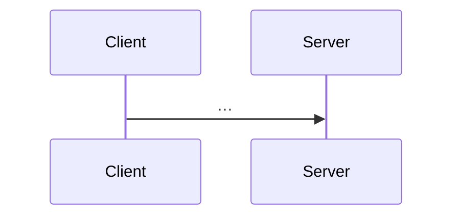

# Flow: {{Flow Name}}

## Trigger

What starts this flow (HTTP endpoint, event, scheduled job, user action).

## Steps

1. Step one — file:line
2. Step two — file:line
3. …

## Sequence diagram

## Involved components

- [[components/x]]
- [[modules/y]]

## Failure modes

- What breaks, and how it's handled.

## Related

- [[decisions/why_this_flow]]
