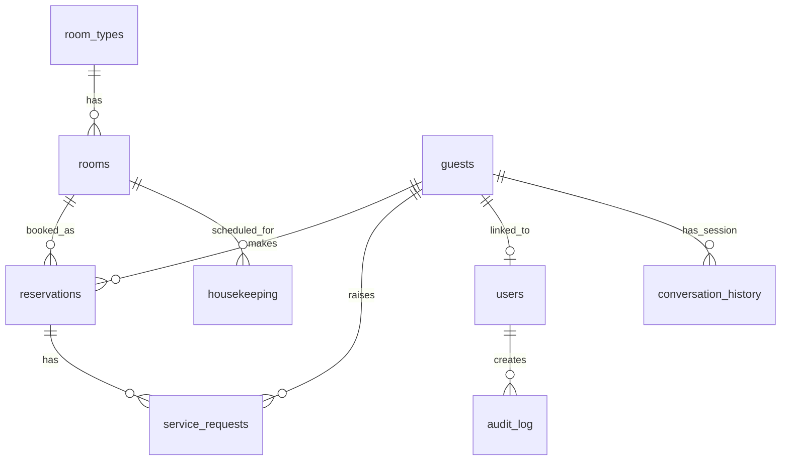

# database.py — Hotel Database Operations

## Purpose

`database.py` is the data access layer for the `hotel_guardrails` service. It provides async-compatible functions for every entity in the hotel PostgreSQL schema: rooms, reservations, guests, conversation history, users (auth), audit log, and admin operations. All SQL is written inline using `psycopg2`; there is no ORM.

---

## Connection Architecture

The module uses a `psycopg2.pool.ThreadedConnectionPool` — a synchronous connection pool designed for multi-threaded environments. This choice is intentional and correct for FastAPI: FastAPI runs handlers in an async event loop, but `run_in_executor` is not used here. Instead, the `database.py` functions are `async def` wrappers around synchronous psycopg2 calls. This is safe because FastAPI's default thread pool handles the blocking I/O implicitly when these functions are awaited from within the async request handlers.

> [!note]
> **Sync-in-async pattern.** The functions are declared `async def` but internally call synchronous psycopg2 operations. This works correctly in single-worker deployments where the event loop is not saturated. Under high concurrency a true async driver (e.g., `asyncpg` or `psycopg3` async mode) would be needed to avoid blocking the event loop. The `requirements.txt` includes `psycopg-binary==3.2.3` (psycopg v3) but it is not used in `database.py` as of this ingestion — the driver upgrade is a future improvement.

### Pool Configuration

| Parameter | Source | Default |
|---|---|---|
| Min connections | `DB_POOL_MIN` env | 2 |
| Max connections | `DB_POOL_MAX` env | 20 |
| DSN | `DATABASE_URL` env (preferred) | constructed from individual env vars |
| Host | `POSTGRES_HOST` env | `localhost` |
| Port | `POSTGRES_PORT` env | `5432` |
| DB name | `POSTGRES_DB` env | `railway` |
| User | `POSTGRES_USER` env | `postgres` |
| Password | `POSTGRES_PASSWORD` env | `password` |

The pool is initialized lazily on first use with a double-checked lock (`_db_pool_lock`) to prevent race conditions during startup. `close_db_pool()` is registered on the FastAPI lifespan shutdown event.

### `get_cursor()` Context Manager

The preferred access pattern. Acquires a connection from the pool, yields `(cursor, conn)` where cursor uses `RealDictCursor` (results returned as dicts rather than tuples), and always returns the connection to the pool on exit — even if an exception is raised. Callers are responsible for calling `conn.commit()` after writes; the context manager does not auto-commit.

---

## Schema

The full schema is defined in `deploy/compose/init-scripts/init-hotel.sql`. The tables cover 9 distinct concerns:

```sql
-- Room catalog (two-level hierarchy)
CREATE TABLE room_types (
    room_type_id  SERIAL PRIMARY KEY,
    name          VARCHAR(100) NOT NULL,
    name_th       VARCHAR(100),               -- Thai name
    description   TEXT,
    description_th TEXT,
    base_price    DECIMAL(10,2) NOT NULL,
    max_occupancy INTEGER NOT NULL,
    amenities     JSONB,                      -- flexible amenity list
    created_at    TIMESTAMP DEFAULT NOW()
);

CREATE TABLE rooms (
    room_id      SERIAL PRIMARY KEY,
    room_number  VARCHAR(20) UNIQUE NOT NULL,
    room_type_id INTEGER REFERENCES room_types,
    floor        INTEGER,
    status       VARCHAR(50) DEFAULT 'available',  -- available|occupied|maintenance|cleaning
    view_type    VARCHAR(50),
    last_cleaned TIMESTAMP,
    notes        TEXT,
    created_at   TIMESTAMP DEFAULT NOW()
);

-- Guest registry
CREATE TABLE guests (
    guest_id      SERIAL PRIMARY KEY,
    first_name    VARCHAR(100) NOT NULL,
    last_name     VARCHAR(100) NOT NULL,
    first_name_th VARCHAR(100),
    last_name_th  VARCHAR(100),
    email         VARCHAR(255) UNIQUE,
    phone         VARCHAR(50),
    id_number     VARCHAR(50),                -- passport / national ID
    nationality   VARCHAR(50),
    loyalty_tier  VARCHAR(50) DEFAULT 'Standard',
    loyalty_points INTEGER DEFAULT 0,
    preferences   JSONB,
    created_at    TIMESTAMP DEFAULT NOW(),
    updated_at    TIMESTAMP DEFAULT NOW()
);

-- Reservations
CREATE TABLE reservations (
    reservation_id      SERIAL PRIMARY KEY,
    confirmation_number VARCHAR(20) UNIQUE,   -- auto-generated: HTL{YYMMDD}{0001}
    guest_id            INTEGER REFERENCES guests,
    room_id             INTEGER REFERENCES rooms,
    check_in_date       DATE NOT NULL,
    check_out_date      DATE NOT NULL,
    num_guests          INTEGER DEFAULT 1,
    status              VARCHAR(50) DEFAULT 'pending',
    total_amount        DECIMAL(10,2),
    payment_status      VARCHAR(50) DEFAULT 'pending',
    special_requests    TEXT,
    booking_source      VARCHAR(100),
    cancellation_reason TEXT,
    created_at          TIMESTAMP DEFAULT NOW(),
    updated_at          TIMESTAMP DEFAULT NOW()
);

-- Service requests (room service, housekeeping, concierge)
CREATE TABLE service_requests (
    request_id     SERIAL PRIMARY KEY,
    reservation_id INTEGER REFERENCES reservations,
    guest_id       INTEGER REFERENCES guests,
    request_type   VARCHAR(100) NOT NULL,
    description    TEXT,
    description_th TEXT,
    status         VARCHAR(50) DEFAULT 'pending',
    priority       VARCHAR(20) DEFAULT 'normal',
    assigned_to    VARCHAR(100),
    created_at     TIMESTAMP DEFAULT NOW(),
    resolved_at    TIMESTAMP
);

-- Housekeeping schedule
CREATE TABLE housekeeping (
    task_id        SERIAL PRIMARY KEY,
    room_id        INTEGER REFERENCES rooms,
    task_type      VARCHAR(100) NOT NULL,
    status         VARCHAR(50) DEFAULT 'pending',
    assigned_to    VARCHAR(100),
    scheduled_date DATE,
    completed_at   TIMESTAMP,
    notes          TEXT,
    created_at     TIMESTAMP DEFAULT NOW()
);

-- Hotel services catalog (static reference data for RAG / concierge)
CREATE TABLE hotel_services (
    service_id         SERIAL PRIMARY KEY,
    name               VARCHAR(100) NOT NULL,
    name_th            VARCHAR(100),
    category           VARCHAR(100),
    description        TEXT,
    description_th     TEXT,
    price              DECIMAL(10,2),
    availability_hours VARCHAR(100),
    location           VARCHAR(100),
    is_active          BOOLEAN DEFAULT TRUE,
    created_at         TIMESTAMP DEFAULT NOW()
);

-- Conversation history (AI context / audit trail)
CREATE TABLE conversation_history (
    conversation_id SERIAL PRIMARY KEY,
    session_id      VARCHAR(100) NOT NULL,
    guest_id        INTEGER REFERENCES guests,
    role            VARCHAR(20) NOT NULL,  -- user|assistant|admin
    content         TEXT NOT NULL,
    created_at      TIMESTAMP DEFAULT NOW()
);

-- User accounts (authentication layer — registered guests + hotel staff)
CREATE TABLE users (
    user_id                 SERIAL PRIMARY KEY,
    username                VARCHAR(64) UNIQUE NOT NULL,
    email                   VARCHAR(255) UNIQUE NOT NULL,
    password_hash           VARCHAR(255) NOT NULL,
    role                    VARCHAR(20) NOT NULL DEFAULT 'user',  -- user|admin
    full_name               VARCHAR(200),
    is_active               BOOLEAN DEFAULT TRUE,
    guest_id                INTEGER REFERENCES guests ON DELETE SET NULL,
    last_login              TIMESTAMP,
    failed_login_attempts   INTEGER DEFAULT 0,
    locked_until            TIMESTAMP,
    password_changed_at     TIMESTAMP DEFAULT NOW(),
    password_is_default     BOOLEAN DEFAULT FALSE,
    created_at              TIMESTAMP DEFAULT NOW(),
    updated_at              TIMESTAMP DEFAULT NOW(),
    CONSTRAINT users_role_check CHECK (role IN ('user', 'admin'))
);

-- Audit log
CREATE TABLE audit_log (
    audit_id       BIGSERIAL PRIMARY KEY,
    actor_user_id  INTEGER REFERENCES users ON DELETE SET NULL,
    actor_username VARCHAR(64),
    actor_role     VARCHAR(20),
    action         VARCHAR(100) NOT NULL,
    resource_type  VARCHAR(50),
    resource_id    VARCHAR(100),
    details        JSONB,
    ip_address     VARCHAR(45),
    user_agent     VARCHAR(500),
    success        BOOLEAN DEFAULT TRUE,
    created_at     TIMESTAMP DEFAULT NOW()
);
```

### ER Diagram



### Confirmation Number Pattern

A PostgreSQL trigger (`set_confirmation_number`) runs `BEFORE INSERT ON reservations`. It generates `'HTL' || TO_CHAR(NOW(), 'YYMMDD') || LPAD(reservation_id::TEXT, 4, '0')` — e.g., `HTL2604200001`. This means the reservation must be INSERTed first (to obtain a serial `reservation_id`) before the confirmation number is computed — a common pattern with serial PKs and derived identifiers.

### Pricing Calculation

`database.py` applies a 7% VAT and 10% service charge in `get_room_by_id()`:
- `tax_rate = 0.07`
- `service_charge = 0.10`
- `total_per_night = base_price * 1.17`

This is hardcoded for Thailand (7% VAT is the standard Thai rate).

---

## CRUD Operation Summary

### Room Operations

| Function | Description | Transactional |
|---|---|---|
| `get_all_room_types()` | Lists all room types with live available-room count via LEFT JOIN + COUNT CASE | Read-only |
| `get_room_by_id(room_id)` | Full room detail with room type info and pricing | Read-only |
| `get_room_by_number(room_number)` | Lookup by room number string; delegates to `get_room_by_id` | Read-only |
| `get_room_availability_calendar(start, end, type)` | Day-by-day availability loop; one query per day | Read-only |
| `admin_update_room_status(room_id, status, notes)` | Sets room status to one of: available, occupied, maintenance, cleaning | `conn.commit()` |

### Booking Operations

| Function | Description | Transactional |
|---|---|---|
| `get_bookings(guest_id, guest_email, status, page, page_size)` | Paginated booking list with guest join; filterable | Read-only |
| `get_booking_by_id(reservation_id)` | Single booking by ID or confirmation number (OR clause) | Read-only |
| `update_booking(reservation_id, ...)` | Validates room availability, recalculates total, applies UPDATE | `conn.commit()` |
| `admin_update_booking_status(reservation_id, status, notes)` | Admin override for any valid status | `conn.commit()` |

### Guest Operations

| Function | Description | Transactional |
|---|---|---|
| `get_guest_by_email(email)` | Case-insensitive email lookup | Read-only |
| `get_guest_by_id(guest_id)` | Direct PK lookup | Read-only |
| `create_guest(email, first_name, ...)` | Inserts new guest; checks for duplicate email first | `conn.commit()` |
| `update_guest(guest_id, ...)` | Dynamic UPDATE for changed fields only | `conn.commit()` |

### Conversation History

| Function | Description | Transactional |
|---|---|---|
| `get_conversation_messages(session_id, limit, offset)` | Paginated message fetch; returns `(messages, total, has_more)` | Read-only |
| `save_conversation_message(session_id, role, content, guest_id)` | Persists one message to `conversation_history` | `conn.commit()` |
| `admin_send_message_to_session(session_id, message)` | Inserts admin-role message for human takeover | `conn.commit()` |

### User / Auth Operations

| Function | Description | Notes |
|---|---|---|
| `ensure_users_table()` | Idempotent `CREATE TABLE IF NOT EXISTS` for users + audit_log; also applies lazy migrations (`ADD COLUMN IF NOT EXISTS`) | Called on startup |
| `create_user(username, email, password_hash, role, ...)` | Creates new user; enforces role ∈ {user, admin} | `password_changed_at` set to `NOW() - 1s` to avoid JWT iat collision |
| `get_user_by_username(username)` | Accepts username or email; returns full row including `password_hash` | For auth flows only |
| `get_user_by_id(user_id)` | PK lookup | For auth flows only |
| `update_user_last_login(user_id)` | Resets `failed_login_attempts = 0`, clears `locked_until` | Called on successful login |
| `record_failed_login(user_id, lockout_threshold, lockout_minutes)` | Increments counter; locks account at threshold (default: 5 failures → 15 min lockout) | Returns `(attempt_count, is_locked)` |
| `update_user_password(user_id, new_hash)` | Sets `password_changed_at = NOW()` — invalidates all existing JWTs for this user | JWT iat < password_changed_at check |
| `any_admin_still_uses_default_password()` | Returns True if any admin has `password_is_default=TRUE` | Used at startup to log security warning |
| `seed_default_admin(username, email, hash, full_name)` | Creates first admin only if none exists; sets `password_is_default=TRUE` | Idempotent on conflict |
| `list_users(role, limit)` | Lists users, optionally by role; excludes `password_hash` | Admin panel use |

### Audit Log Operations

| Function | Description |
|---|---|
| `log_audit(action, actor_*, resource_*, details, ...)` | Inserts one audit record; **never raises** — errors are logged only |
| `list_audit_entries(limit, offset, filters...)` | Paginated audit query with 9 optional filters; max 500 rows per page |
| `get_audit_stats()` | Aggregates total events, top actions last 24h, failed events, top actors |

### Dashboard / Admin Statistics

| Function | Description |
|---|---|
| `get_dashboard_stats()` | Room status breakdown, reservation counts, today's arrivals/departures, revenue totals, occupancy rate |
| `get_recent_bookings(limit)` | Most recent N bookings for live feed |
| `get_active_sessions_stats()` | 24-hour conversation counts by role (user/assistant/admin) |
| `check_database_health()` | Runs `SELECT 1` + counts room_types and rooms; returns health dict |

---

## Transactional Boundaries

`database.py` does not use `BEGIN`/`COMMIT` blocks explicitly for multi-statement operations. Each function that writes calls `conn.commit()` at the end of its single operation. There are no multi-table transactions — for example, `update_booking` updates only the `reservations` table; room status is not updated atomically alongside the booking change.

> [!note]
> **No distributed transactions.** Booking creation in `hotel_tools.py` (called via `actions.py`) writes to `reservations`. If a subsequent step (e.g., sending a confirmation email mock) fails, the reservation record already exists. This is acceptable for a demo system but would require saga/compensation patterns in production.

---

## Related

- [[components/actions]] — tool wrappers that call hotel_tools.py; booking confirmation logs feed memory extraction
- [[flows/reservation_lifecycle]] — how these CRUD ops compose into a booking flow
- [[entities/PostgreSQL]] — database entity page with infra details
- [[modules/hotel_guardrails]] — parent module; server.py calls database.py directly for most endpoints
- [[concepts/persistent_memory_chatbot]] — conversation_history table feeds memory store design
