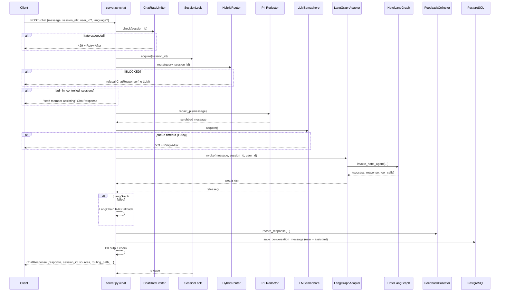

# server.py — FastAPI Entry Point

The primary entry point for the hotel_guardrails service. Defines the [[FastAPI]] application, wires up lifecycle management, registers all HTTP endpoints, applies middleware, and integrates the [[hybrid_router]], [[langgraph_adapter]], and [[feedback_collector]] components.

---

## Entry Point and App Factory

The file exposes a single FastAPI `app` instance:

```python
app = FastAPI(
    title="The Grand Horizon Hotel Concierge API",
    version="1.0.0",
    lifespan=lifespan,
    docs_url="/docs",
    redoc_url="/redoc",
    openapi_tags=tags_metadata,
)
```

Run with:

```bash
python -m uvicorn src.hotel_guardrails.server:app --host 0.0.0.0 --port 8081 --reload
```

Interactive docs available at `GET /docs` (Swagger UI) and `GET /redoc` (ReDoc).

> [!note]
> The server auto-exports the live OpenAPI spec to `docs/api_references/hotel_guardrails_server.json` on every startup. The companion YAML in `docs/api_references/hotel_guardrails_server.yaml` is the hand-maintained snapshot. The JSON file (auto-generated) is the authoritative runtime spec.

---

## Lifespan — Startup and Shutdown

The `lifespan(app)` async context manager (registered with FastAPI) runs all initialisation before the server accepts requests and all cleanup after the last request completes.

### Startup sequence

| Order | Action | Details |
|---|---|---|
| 1 | `RuntimeLLMConfig` singleton | Reads `APP_LLM_MODELNAME`, `APP_LLM_MODELENGINE` env vars |
| 2 | `OpenRouter API key` | Copies `OPENROUTER_API_KEY` → `OPENAI_API_KEY` for LangChain compat |
| 3 | LangChain LLM (fallback) | `get_openrouter_llm()` — used only when LangGraph fails |
| 4 | Checkpointer (short-term memory) | `init_checkpointer()` → `AsyncPostgresSaver` if `DATABASE_URL` present, else `MemorySaver` |
| 5 | Store (long-term memory) | `init_store()` → `AsyncPostgresStore` if `DATABASE_URL` present, else `InMemoryStore` |
| 6 | Users table + default admin seed | `db.ensure_users_table()` + `db.seed_default_admin()`. Emits security warnings if JWT secret is weak or default admin password is unchanged |
| 7 | `FeedbackCollector` | Initialised unconditionally |
| 8 | `HybridRouter` | Receives `feedback_store` callback for score-based routing tuning |
| 9 | `LangGraphAdapter` | Receives both `checkpointer` and `store`; pre-loads the embedded graph via `get_hotel_graph(checkpointer, store)` |
| 10 | `EscalationMonitor` | Auto-escalation trigger for frustrated/high-value sessions |
| 11 | Chat scaling config log | Logs concurrency limits, rate limits, and cache config at INFO level |
| 12 | Anonymous memory sweeper task | `asyncio.create_task(_anon_memory_sweeper())` — 24-hour interval, 30-day TTL for `("anon", session_id)` namespace entries |

### Anonymous memory sweeper

```python
async def _anon_memory_sweeper():
    from src.hotel_guardrails.hotel_langgraph import prune_anon_memory
    while True:
        await prune_anon_memory(max_age_days=30)
        await asyncio.sleep(24 * 60 * 60)
```

Guest memories stored under the anonymous namespace (`user_id=None`) are pruned after 30 days. Memories tied to a stable `user_id` (`("guest", user_id)` namespace) are kept indefinitely. See [[guest_memory_store]] for the store design.

### Shutdown sequence

Shutdown steps (in order): cancel sweeper task, `close_store()`, `close_checkpointer()`, `db.close_db_pool()`.

---

## Endpoints Catalog

### Health

| Method | Path | Auth | Request | Response | Notes |
|---|---|---|---|---|---|
| GET | `/healthz` | No | — | `{"status": "ok"}` | Lightweight probe for Railway / K8s load balancers |
| GET | `/health` | No | — | `HealthResponse` | Full component status: LangGraph, Qdrant, OpenRouter, PostgreSQL |

### Auth

| Method | Path | Auth | Request | Response | Notes |
|---|---|---|---|---|---|
| POST | `/auth/register` | No | `UserRegisterRequest` | `TokenResponse` | Self-service user registration; role=`user` |
| POST | `/auth/login` | No | `UserLoginRequest` | `TokenResponse` | Per-IP (10/min) + per-user (5/min) rate limits; 5-fail lockout (15 min) |
| POST | `/auth/logout` | JWT | — | `GenericSuccessResponse` | Adds JWT `jti` to in-memory blocklist |
| PATCH | `/auth/me/password` | JWT | `PasswordChangeRequest` | `GenericSuccessResponse` | Invalidates ALL existing JWTs via `password_changed_at` |
| GET | `/auth/me` | JWT | — | `UserResponse` | Current user profile |
| POST | `/auth/admin/register` | Admin JWT | `UserRegisterRequest` | `UserResponse` | Creates role=`admin` account |
| GET | `/auth/users` | Admin JWT | `role?`, `limit?` | `{users, count}` | List all users |

### Chat

| Method | Path | Auth | Request | Response | Notes |
|---|---|---|---|---|---|
| POST | `/chat` | No | `ChatRequest` | `ChatResponse` | Main AI conversation endpoint |
| POST | `/chat/stream` | No | `ChatRequest` | SSE stream of `StreamChunk` | Server-Sent Events; real-time token delivery |

### Rooms

| Method | Path | Auth | Request | Response | Notes |
|---|---|---|---|---|---|
| GET | `/rooms` | No | — | `RoomListResponse` | All room types with availability counts |
| GET | `/rooms/availability` | No | `start_date`, `end_date`, `room_type?` | `RoomAvailabilityResponse` | Calendar view; max 90-day range |
| GET | `/rooms/{room_id}` | No | path: `room_id: int` | `RoomDetailResponse` | Single room + pricing breakdown |

> [!note]
> `/rooms/availability` is registered **before** `/rooms/{room_id}` in the source to prevent FastAPI routing the literal string `availability` as a `room_id` integer parameter.

### Booking

| Method | Path | Auth | Request | Response | Notes |
|---|---|---|---|---|---|
| POST | `/tools/book` | No | `BookingRequest` | `BookingResponse` | Actions: check / create / confirm / cancel |
| GET | `/bookings` | No | `guest_id?`, `guest_email?`, `status?`, `page`, `page_size` | `BookingListResponse` | Filterable, paginated |
| GET | `/bookings/{reservation_id}` | No | path: `reservation_id: str` | `BookingInfo` | Lookup by ID or confirmation number |
| PATCH | `/bookings/{reservation_id}` | No | `BookingUpdateRequest` | `BookingUpdateResponse` | Modify dates, room, guests, special requests |

### Guests

| Method | Path | Auth | Request | Response | Notes |
|---|---|---|---|---|---|
| POST | `/guests` | No | `GuestCreateRequest` | `GuestCreateResponse` | Register new guest |
| GET | `/guests/{guest_id}` | No | path: `guest_id: int` | `GuestResponse` | Fetch guest profile |
| PATCH | `/guests/{guest_id}` | No | `GuestUpdateRequest` | `GuestResponse` | Update guest profile |

### Sessions

| Method | Path | Auth | Request | Response | Notes |
|---|---|---|---|---|---|
| POST | `/sessions` | No | — | `SessionCreateResponse` | Pre-create a session ID |
| GET | `/sessions/{session_id}` | No | path | `SessionInfo` | Session metadata |
| DELETE | `/sessions/{session_id}` | No | path | — | Clear all history for session |
| GET | `/sessions/{session_id}/messages` | No | `limit?`, `offset?` | `ConversationHistoryResponse` | Paginated message history |

### Settings

| Method | Path | Auth | Request | Response | Notes |
|---|---|---|---|---|---|
| GET | `/settings/llm` | No | — | `LLMSettingsResponse` | Current LLM backend, model, temperature |
| PUT | `/settings/llm` | No | `LLMSettingsUpdateRequest` | `LLMSettingsResponse` | Hot-switch model/backend; no restart needed |
| GET | `/settings/models` | No | — | `{models: [...]}` | List available models |

### Feedback

| Method | Path | Auth | Request | Response | Notes |
|---|---|---|---|---|---|
| POST | `/feedback` | No | query: `request_id`, `score`, `comment?` | `{}` | Submit explicit quality rating (0.0–1.0) |
| GET | `/feedback/stats` | No | — | `{}` | Aggregate score per routing path |

### Admin (requires Admin JWT)

| Method | Path | Auth | Notes |
|---|---|---|---|
| PATCH | `/admin/rooms/{room_id}/status` | Admin JWT | Override room status |
| PATCH | `/admin/bookings/{reservation_id}/status` | Admin JWT | Override booking status |
| POST | `/admin/chat/override` | Admin JWT | Inject admin message into guest session |
| GET | `/admin/sessions` | Admin JWT | List all active sessions |

### Dashboard (requires Admin JWT)

| Method | Path | Auth | Response | Notes |
|---|---|---|---|---|
| GET | `/dashboard/stats` | Admin JWT | `DashboardStatsResponse` | Occupancy, revenue, today's activity |
| GET | `/dashboard/bookings/recent` | Admin JWT | `[RecentBookingItem]` | Recent booking feed |
| GET | `/dashboard/sessions/stats` | Admin JWT | `SessionStatsResponse` | Conversation volume metrics |

### Root

| Method | Path | Response |
|---|---|---|
| GET | `/` | `{name, version, docs, status}` |

---

## Middleware Stack

Middleware is evaluated in reverse registration order (outermost first in request path):

1. **CORS** (`CORSMiddleware`) — registered with `add_middleware()`. Uses `allow_origin_regex=".*"` (not `allow_origins=["*"]`) because the browser blocks `allow_credentials=True` + `allow_origins=["*"]` together. Exposes `X-Request-ID` and `X-Session-ID` response headers.
2. **Request Tracking** (custom `@app.middleware("http")`) — reads or generates `X-Request-ID` header; stores it in a `ContextVar`; logs `→ METHOD /path` and `← STATUS_CODE (Nms)` at INFO level; echoes the ID back in all response headers.

---

## Error Handling and Status Codes

Two global exception handlers cover the entire app:

| Handler | Trigger | Status | Response body |
|---|---|---|---|
| `validation_exception_handler` | `RequestValidationError` (Pydantic) | 422 | `ErrorResponse(error="validation_error", details=exc.errors())` |
| `general_exception_handler` | Any uncaught `Exception` | 500 | `ErrorResponse(error="internal_error", details={type, request_id})` |

Both handlers include `X-Request-ID` in the response headers.

Standard status codes used in handlers:

| Code | Meaning in this API |
|---|---|
| 400 | Bad request (missing required fields, invalid action) |
| 401 | Authentication failed (wrong password, expired token) |
| 403 | Forbidden (account disabled) |
| 422 | Pydantic validation error |
| 423 | Account locked (too many failed logins) |
| 429 | Rate limit exceeded (chat, login); `Retry-After` header set |
| 503 | LLM queue saturated or no LLM available; `Retry-After` header set |

---

## `/chat` Request Lifecycle

The `/chat` handler delegates the heavy work to `_process_chat_locked()` after acquiring a per-session async lock. The lock prevents concurrent requests to the same session from corrupting the LangGraph checkpointer state.



> [!note]
> The `user_id` field from `ChatRequest` is forwarded as-is to `LangGraphAdapter.invoke()`. If `user_id` is `None`, the value `"guest"` is substituted at the call site: `user_id=request.user_id or "guest"`. This default puts the memory entry in the anonymous namespace subject to 30-day TTL cleanup.

---

## Integration Points

| Component | How server.py interacts |
|---|---|
| [[hybrid_router]] | `hybrid_router.route(query, session_id)` — called first inside `_process_chat_locked()`; returns `RoutingPath` enum and `complexity` classification |
| [[langgraph_adapter]] | `langgraph_adapter.invoke(message, session_id, user_id)` — primary LLM call path; adapter holds the pre-loaded graph |
| [[guest_memory_store]] | Passed to `LangGraphAdapter(checkpointer=..., store=...)` during lifespan startup; not directly called from endpoint handlers |
| [[feedback_collector]] | `feedback_collector.record_response(...)` after every successful response; `feedback_collector.get_average_score` callback wired into `HybridRouter` |
| `database.py` | Used directly in endpoints for rooms, bookings, guests, sessions, users, and audit log |
| `auth.py` | JWT verification (`get_current_user`, `require_admin`) injected via `Depends()` on protected endpoints |
| `chat_scaling.py` | `llm_limiter` (semaphore), `session_locks` (per-session lock), `chat_rate_limiter`, `stream_limiter`, `knowledge_cache` all imported and used directly |
| `escalation.py` | `escalation_monitor.should_escalate()` called after every response; on trigger, session added to `admin_controlled_sessions` set |
| `pii_redactor.py` | `redact_pii()` on inbound message; `check_output_pii()` on generated response |

---

## Contradictions and Anomalies

> [!contradiction]
> **Port mismatch.** `CLAUDE.md` documents port 8081 as the primary port, and the server docstring header also says 8081. However, the `/chat/stream` endpoint docstring example hardcodes port 8088 (`curl ... http://localhost:8088/chat/stream`). Docker Compose dev stack (`docker-compose.dev.yaml`) binds the container to port 8088 on the host. Both are valid in their respective contexts; the discrepancy is a legacy comment artefact from the Docker mapping. See [[local_run]] for port assignment details.

> [!note]
> **Hotel naming drift — resolved 2026-04-20.** Canonical name is **"The Grand Horizon Hotel"** (EN) / **"โรงแรม เดอะ แกรนด์ ฮอไรซัน"** (TH). Previous drift across the OpenAPI YAML title, the LangChain fallback Thai greeting in `server.py:~1114`, `openrouter_llm.py` referer default, and the `data/hotel/*.md` KB has been unified. See the 2026-04-20 entry in [[log]].

---

## Related

- [[components/pydantic_models]] — all request/response schemas
- [[components/langgraph_adapter]] — LLM invocation bridge
- [[components/hybrid_router]] — safety pre-filter
- [[guest_memory_store]] — store and checkpointer lifecycle (Agent A)
- [[flows/guest_chat]] — end-to-end chat flow narrative
- [[references/hotel_guardrails_api]] — full endpoint reference
- [[modules/hotel_guardrails]] — module overview
