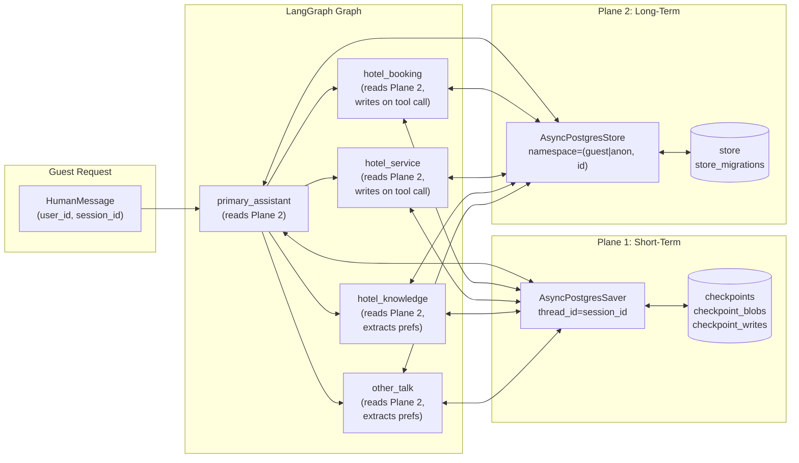

# Dual-Plane Memory Architecture

> [!key-insight]
> The dual-plane model is the novel architectural contribution of this thesis. It combines two LangGraph abstractions — `PostgresSaver` (short-term) and `PostgresStore` (long-term) — into a single coherent memory layer that operates across both conversation turns and sessions.

## The Two Planes

### Plane 1 — Short-Term (PostgresSaver / Checkpointer)

**Purpose:** Retain the full message history, tool results, and routing decisions within a single conversation session, surviving process restarts.

**Mechanics:**
- LangGraph `AsyncPostgresSaver` invoked automatically after every graph node transition.
- Keyed by `thread_id = session_id` — each conversation gets its own thread.
- Backed by three PostgreSQL tables: `checkpoints`, `checkpoint_blobs`, `checkpoint_writes`.
- Supports "time-travel" replay: any prior state snapshot can be re-read or rolled back.
- Fallback: `MemorySaver` (in-process, volatile) when `DATABASE_URL` is absent.

**Scope:** Strictly intra-session. When the guest starts a new session (new `session_id`), the checkpointer has no memory of the previous one.

### Plane 2 — Long-Term (PostgresStore)

**Purpose:** Retain guest facts — preferences, profile, booking history, service history — across sessions indefinitely (for known guests) or for 30 days (anonymous).

**Mechanics:**
- LangGraph `AsyncPostgresStore`, a thread-agnostic key-value store with namespaced access.
- Keyed by a two-level namespace tuple: `("guest", user_id)` or `("anon", session_id)`.
- Backed by two PostgreSQL tables: `store`, `store_migrations`.
- Accessed via `load_guest_memory()` / `upsert_guest_memory()` helper functions in `hotel_langgraph.py`.
- Fallback: `InMemoryStore` (volatile) when `AsyncPostgresStore` is not importable or `DATABASE_URL` is absent.

**Scope:** Crosses session boundaries. The same guest returning days later with a fresh `session_id` but the same `user_id` recovers all stored facts from Plane 2.

## Why Two Separate Planes?

The two planes serve fundamentally different needs:

| Dimension | Short-Term (Checkpointer) | Long-Term (Store) |
|---|---|---|
| Unit of identity | `session_id` (thread_id) | `user_id` (namespace) |
| Invocation timing | Automatic — after every node | Manual — sub-agents read/write explicitly |
| Data shape | Full `HotelState` snapshot | Small key-value facts |
| Retention | Per-session, never pruned | Indefinite (guest) / 30 days (anon) |
| Consistency requirement | Serialized per thread | Concurrent writes OK (MVCC) |
| Failure mode if disabled | Session state lost on restart | Personalisation degraded to stateless |

Coupling the two would force them to share the same retention policy, consistency model, and connection pool — compromising both.

## Separate Connection Pools

Both planes use `AsyncConnectionPool` from `psycopg_pool`, but they are **separate pools**:

- Checkpointer pool: `min_size=2, max_size=10`
- Store pool: `min_size=1, max_size=5`

This isolation means a slow or stuck store operation (e.g. a large preference scan) cannot exhaust the connections available to the checkpointer, which must respond quickly on every node transition.

## Architecture Diagram



## Namespace Convention

```
("guest", "user-123")           → authenticated guest, indefinite retention
  keys: profile, preferences, recent_bookings_summary, service_history_summary

("anon", "session-abc-def")     → anonymous session, purged after 30 days
  same key schema
```

The `_memory_namespace()` helper in `hotel_langgraph.py` selects the correct namespace:
- `user_id` present and not equal to the literal string `"guest"` → `("guest", user_id)`
- Otherwise → `("anon", session_id)`

## Memory Facts Schema

| Key | Type | Content |
|---|---|---|
| `profile` | `dict` | `{name, email, loyalty_tier, language}` |
| `preferences` | `dict` | `{floor, allergy, diet, bed, quiet, pillows}` |
| `recent_bookings_summary` | `list[dict]` | `[{room_type, check_in, check_out, guests}, …]` (last 10) |
| `service_history_summary` | `list[str]` | `["extra_pillows", "wake_up_call", …]` (last 10, deduplicated) |

## Env Controls

| Variable | Value | Effect |
|---|---|---|
| `APP_STORE_NAME` | `postgres` (default) | AsyncPostgresStore backed by PostgreSQL |
| `APP_STORE_NAME` | `memory` | InMemoryStore (volatile, useful for unit tests) |
| `APP_STORE_NAME` | `off` | Store disabled; personalisation silently skipped |
| `APP_CHECKPOINTER_NAME` | `postgres` (default) | AsyncPostgresSaver |
| `APP_CHECKPOINTER_NAME` | `memory` | MemorySaver |

## Related

- [[thesis/memory_system_design]] — thesis-level write-up with Chapter 2 §2.3.4 text
- [[components/guest_memory_store]] — `init_store()`/`close_store()` implementation
- [[components/memory_preamble_injector]] — how Plane 2 data enters sub-agent prompts
- [[concepts/rule_based_memory_write_back]] — how facts are written without LLM calls
- [[concepts/bilingual_memory_extraction]] — Thai + English keyword extraction
- [[concepts/anon_namespace_ttl]] — anonymous session TTL
- [[flows/cross_session_memory]] — end-to-end sequence diagram
- [[entities/PostgreSQL]] — the database backing both planes
- [[entities/LangGraph]] — checkpointer and store abstractions
