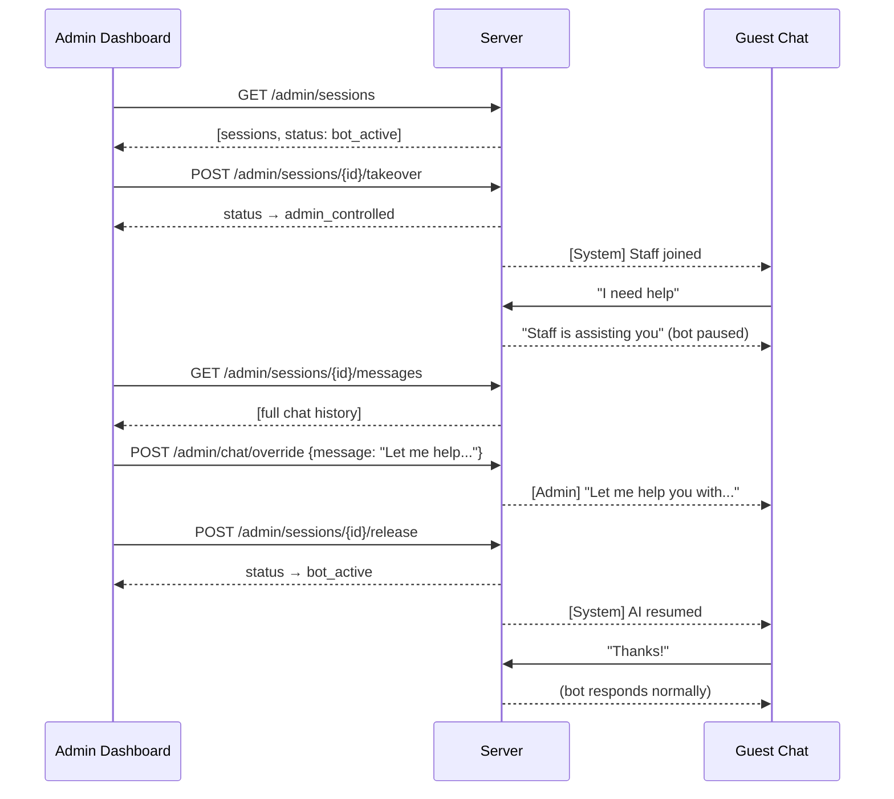
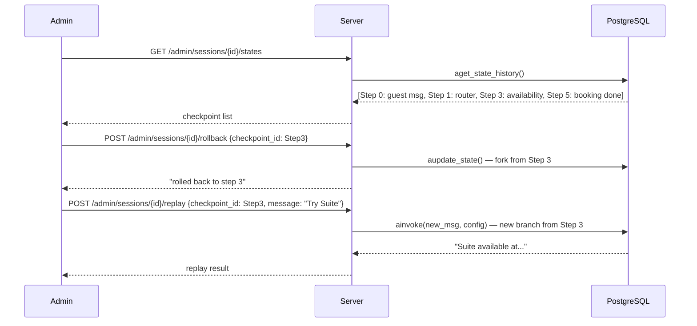
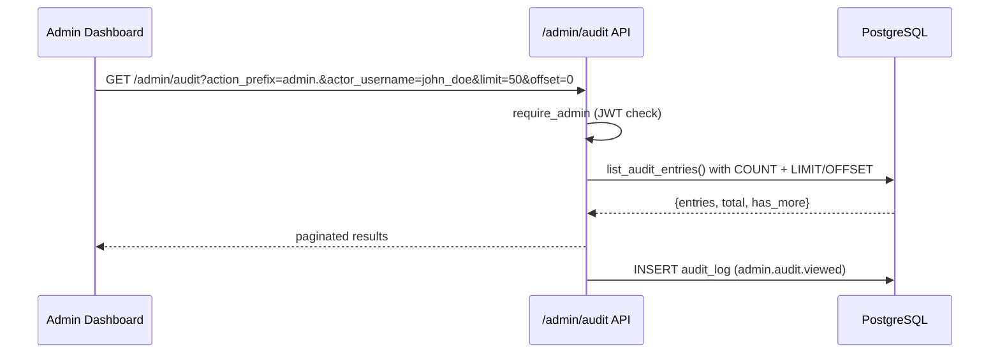

# Flow: Admin Monitoring & Intervention

All routes require a valid admin JWT (`Authorization: Bearer <admin-JWT>`). Non-admin tokens get 403.

## Session takeover

Admin can pause the bot and reply directly to a guest, then hand back to the bot.



## Auto-escalation

The escalation monitor triggers automatically without admin action. Once triggered, session status → `admin_controlled`.

Triggers:
- Negative sentiment keyword (e.g., "terrible service")
- Guest repeats the same question 3× in a row
- Booking value > 50,000 THB
- Penthouse room inquiry

Admins view escalated sessions at `GET /admin/escalations`.

## Time-travel / checkpoint replay

LangGraph persists state checkpoints to PostgreSQL. Admins can view, rewind, and branch from any step.



## Runtime LLM switching

`PUT /settings/llm` (admin only) switches the backend model at runtime — no restart required.

```
PUT /settings/llm
{
  "backend": "ollama" | "openrouter",
  "model": "qwen3.5-opus:9b" | "qwen/qwen3-max" | "minimax-m2.7" | ...
}
```

Per-model presets are applied automatically: temperature, max_tokens, thinking mode, rate limiter (20 req/min for cloud).

Current LLM config is readable (no auth) at `GET /settings/llm`. Available models at `GET /settings/models`.

## Audit log

Every admin action, auth event, and privacy-sensitive operation is written to `audit_log`.

### Schema

```sql
audit_log (
    audit_id       BIGSERIAL PK
    actor_user_id  INTEGER (FK users)
    actor_username VARCHAR(64)
    actor_role     VARCHAR(20)      -- 'user' | 'admin'
    action         VARCHAR(100)     -- e.g., 'auth.login.success'
    resource_type  VARCHAR(50)      -- e.g., 'session', 'user', 'booking'
    resource_id    VARCHAR(100)
    details        JSONB
    ip_address     VARCHAR(45)
    user_agent     VARCHAR(500)
    success        BOOLEAN
    created_at     TIMESTAMP
)
```

### Action taxonomy

| Domain | Actions |
|---|---|
| Auth | `auth.login.success`, `auth.login.failed`, `auth.login.locked`, `auth.login.rate_limited`, `auth.logout`, `auth.register`, `auth.password.changed`, `auth.password.change_failed` |
| User management | `user.admin.created`, `user.list` |
| Room / booking overrides | `admin.room.status_changed`, `admin.booking.status_changed` |
| Chat / session | `admin.chat.override`, `admin.session.takeover`, `admin.session.release`, `admin.session.viewed`, `admin.session.listed`, `admin.session.rollback`, `admin.session.replay`, `admin.escalations.viewed` |
| System | `settings.llm.changed`, `admin.audit.viewed` |

**Meta-audit**: `GET /admin/audit` itself is logged as `admin.audit.viewed`.

**Privacy**: `GET /admin/sessions/{id}/messages` writes `admin.session.viewed` — auditable trail of who accessed which guest's chat history.

### Audit query flow



## Dashboard endpoints

| Endpoint | Data |
|---|---|
| `GET /dashboard/stats` | Occupancy, revenue, check-ins/outs, guests |
| `GET /dashboard/bookings/recent` | Live feed of latest bookings |
| `GET /dashboard/sessions` | Chatbot session statistics (24h) |
| `GET /dashboard/rooms` | Room status breakdown by floor |
| `GET /dashboard/revenue` | Revenue by room type, source, daily trend |

## Chat scaling metrics

`GET /admin/metrics/chat` returns live runtime stats:

```json
{
  "llm_limiter":     { "max_concurrent": 4, "in_flight": 2, "waiting": 0,
                       "total_acquired": 1247, "total_rejected": 3 },
  "session_locks":   { "tracked_sessions": 42, "currently_locked": 2 },
  "chat_rate_limiter": { "tracked_sessions": 42, "active_sessions": 15, "total_rejected": 17 },
  "stream_limiter":  { "max_concurrent": 20, "active": 3 },
  "knowledge_cache": { "size": 47, "hits": 312, "misses": 98, "hit_rate": 0.761 }
}
```

Use for Grafana dashboards; alert when `llm_limiter.total_rejected` grows or `knowledge_cache.hit_rate` drops below 0.3.

## Related

- [[auth_and_access_control]] — JWT requirements for these routes
- [[chat_scaling]] — what the metrics endpoint reports
- [[hotel_langgraph]] — checkpoint storage used by time-travel
- [[decisions/time_travel_checkpoints]] — why LangGraph state history is persisted
