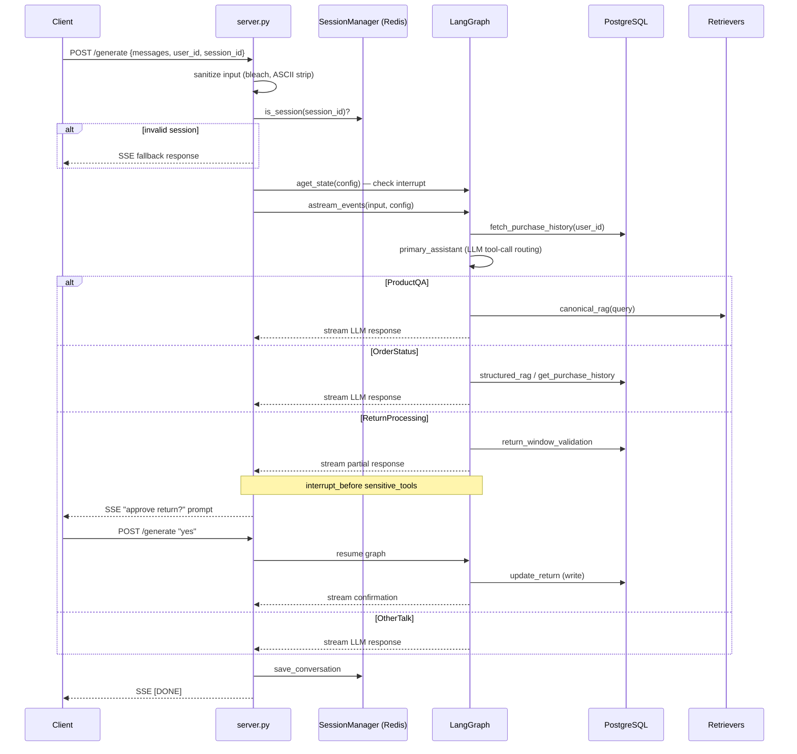

# Flow: Agent Chat Pipeline

End-to-end request path through the [[agent]] service StateGraph. Covers session setup, graph execution, streaming SSE output, and the human-in-the-loop return confirmation.

## Trigger

`POST /generate` with a `Prompt` payload: `{messages, user_id, session_id}`.

## Pre-conditions

- A session must have been created via `GET /create_session` beforehand. Requests with an unknown `session_id` receive a fallback SSE response immediately.

## Steps

1. **Input sanitization** (`server.py`) — `bleach.clean()` strips HTML from all message content; non-ASCII and trademark symbols are removed from the last user message.
2. **Session validation** — `SessionManager.is_session(session_id)` checks Redis cache. Invalid session → fallback response generator.
3. **Interrupt check** — `graph.aget_state(config)` inspects the LangGraph checkpointer. If `snapshot.next` is non-empty, the graph is paused at `interrupt_before=["return_processing_sensitive_tools"]` (awaiting user approval for a return).
   - User replied "yes/y/Y" → `input_for_graph = None` (graph resumes from checkpoint).
   - User replied anything else → inject `ToolMessage` denial → graph re-routes.
4. **Graph invocation** — `graph.astream_events(input_for_graph, version="v2", config)` streams events.
5. **fetch_purchase_history** (START → node) — synchronous PostgreSQL query; populates `user_purchase_history` and clears `current_product`.
6. **primary_assistant** ([[agent_router]]) — LLM selects routing tool via function-calling.
7. **Sub-agent branch** (one of):
   - `enter_product_qa` → `handle_product_qa` → RAG → LLM → END
   - `enter_order_status` → `order_validation` → `order_status` tool loop → END (or `ask_clarification` if ambiguous)
   - `enter_return_processing` → `return_validation` → `return_processing` tool loop → **interrupt** → (user confirms) → `update_return` → END
   - `other_talk` → LLM response → END
8. **Streaming output** — `on_chat_model_stream` events tagged `should_stream` are forwarded as SSE `ChainResponse` chunks. Non-streaming fallback uses `on_chain_end` final message content.
9. **Return interrupt prompt** — after graph ends, if `snapshot.next` is non-empty, the server appends a confirmation message SSE chunk.
10. **Session save** — `SessionManager.save_conversation()` persists the exchange to Redis.
11. **Termination chunk** — SSE frame with `finish_reason="[DONE]"` closes the stream.

## Sequence diagram

## Failure modes

| Failure | Handling |
| --- | --- |
| `GraphRecursionError` | Caught in `response_generator`; fallback SSE sent |
| `asyncio.TimeoutError` | Caught; log message suggests increasing `GRAPH_TIMEOUT_IN_SEC` |
| Retriever HTTP error | `structured_rag` silently falls back to direct DB query |
| LLM empty response | `Assistant` class retries up to recursion limit with "Respond with a real output." |
| Any other exception | Caught broadly; random fallback phrase returned as SSE stream |

## Configuration

| Env var | Default | Effect |
| --- | --- | --- |
| `GRAPH_RECURSION_LIMIT` | 6 | Max LangGraph steps per request |
| `GRAPH_TIMEOUT_IN_SEC` | None | `step_timeout` on the compiled graph |
| `LOGLEVEL=DEBUG` | — | Enables LangGraph debug event logging |

## Comparison to hotel_guardrails

The [[guest_chat]] flow in [[hotel_guardrails]] is structurally parallel but differs in several ways:

- **Safety layer**: `hotel_guardrails` adds [[hybrid_router]] (NeMo Guardrails safety check) before LangGraph; `agent` has no equivalent safety filter.
- **No purchase-history pre-fetch**: `hotel_guardrails` does not have a `fetch_purchase_history` equivalent — guest identity is resolved per-tool via email.
- **Human-in-the-loop**: `agent` has an explicit interrupt for return approval; `hotel_guardrails` does not interrupt for any action.
- **Endpoint name**: `agent` uses `/generate`; `hotel_guardrails` uses `/chat`.
- **Port**: both bind to 8081 (bare metal) or different ports under Docker Compose.

## Related

- [[agent]] — module page
- [[guest_chat]] — hotel_guardrails equivalent
- [[human_in_the_loop]] — concept
- [[RAG]] — retrieval pattern used in ProductQA and OrderStatus branches
