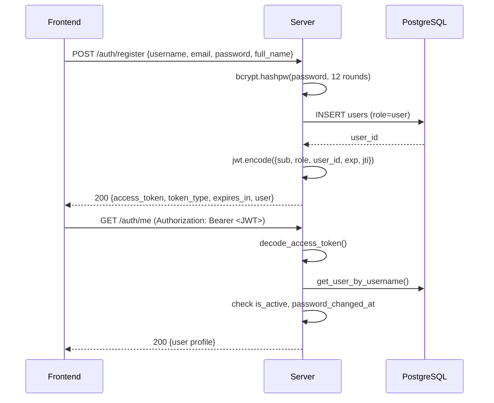
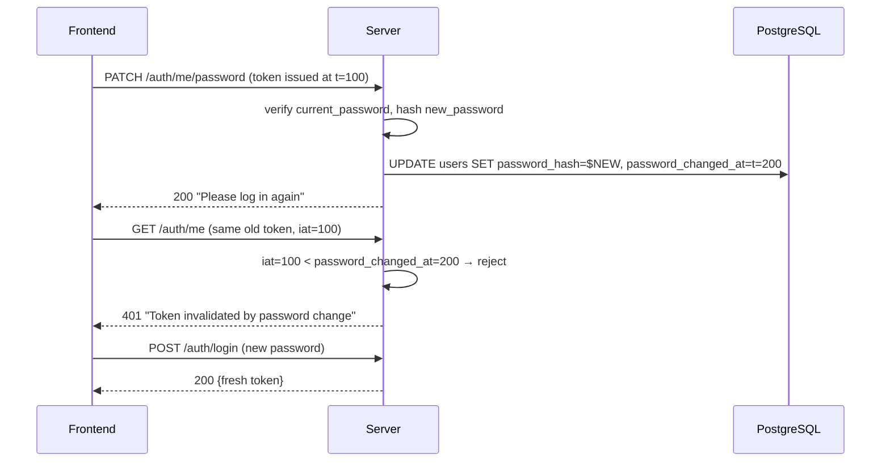

# Flow: Authentication & Access Control

Two identity systems coexist. Guest chat uses email-only identification (no login). Registered users and admins use JWT bearer tokens.

## Identity systems

```
  GUESTS table                      USERS table
  (hotel profile)                   (login credentials)
  ─────────────────                 ──────────────────────────
  guest_id (PK)          ←──FK──   guest_id (FK, nullable)
  email (unique)                    user_id (PK)
  first/last name                   username (unique)
  phone, nationality                email (unique)
  loyalty_tier/points               password_hash (bcrypt)
  preferences                       role ('user' | 'admin')
                                    is_active, last_login
                                    failed_login_attempts
                                    locked_until
                                    password_changed_at

  Used by:                          Used by:
  Guest chat flow                   Registered users (JWT)
  (no login required)               Admins (JWT, elevated access)
```

- Guest chat flow (`/chat`, `/rooms`, `/bookings`, `/guests`) — email-only, no token needed.
- Registered users — log in, receive JWT, manage booking history across sessions.
- Admins — hotel staff. Admin JWT required for `/admin/*`, `/dashboard/*`, `PUT /settings/llm`.
- Default admin seeded from `DEFAULT_ADMIN_USERNAME` / `DEFAULT_ADMIN_PASSWORD` env vars (**must** be changed in production).

## Access control matrix

| Scenario | `/auth/me` | `/admin/*` | `/dashboard/*` | `PUT /settings/llm` | `/chat`, `/rooms`, `/health` |
|---|:-:|:-:|:-:|:-:|:-:|
| No token | 401 | 401 | 401 | 401 | 200 |
| Valid user token | 200 | 403 | 403 | 403 | 200 |
| Valid admin token | 200 | 200 | 200 | 200 | 200 |
| Invalid / expired JWT | 401 | 401 | 401 | 401 | 200 |

## Registration & login flow



## Login hardening (production)

```
Login attempt
     │
     ▼
┌─────────────────────┐  429 + Retry-After
│ Per-IP rate limit   │──► "Too many attempts from this IP"
│ LOGIN_RATE_LIMIT_   │
│ PER_IP = 100/min    │
└─────────────────────┘
     │
     ▼
┌─────────────────────┐  429 + Retry-After
│ Per-user rate limit │──► "Too many attempts for this account"
│ LOGIN_RATE_LIMIT_   │
│ PER_USER = 5/min    │
└─────────────────────┘
     │
     ▼
┌─────────────────────┐  423 + Retry-After
│ Account lockout     │──► "Locked for 15m after 5 failures"
│ LOCKOUT_THRESHOLD=5 │
│ LOCKOUT_MINUTES=15  │
└─────────────────────┘
     │
     ▼
┌─────────────────────┐  401
│ Password verify     │──► Increment failed_login_attempts
│ (bcrypt)            │
└─────────────────────┘
     │ (success)
     ▼
Issue JWT with jti + reset failed_login_attempts counter
```

| Protection | Mechanism | Response |
|---|---|---|
| Rate limit per IP | Sliding window, `LOGIN_RATE_LIMIT_PER_IP=100`/min | 429 + `Retry-After` |
| Rate limit per user | Sliding window, `LOGIN_RATE_LIMIT_PER_USER=5`/min | 429 + `Retry-After` |
| Account lockout | `users.locked_until`, `LOCKOUT_THRESHOLD=5` fails → `LOCKOUT_MINUTES=15` | 423 + `Retry-After` |
| Token revocation | `/auth/logout` → jti into in-memory blocklist until natural expiry | 401 on reuse |
| Password-change invalidation | `users.password_changed_at`; tokens with `iat` before change rejected | 401, survives restart |

## Password change flow (time-travel safe)



`password_changed_at` is persistent in the DB → invalidation survives server restarts, unlike the in-memory jti blocklist. Use password change for "force logout everywhere" scenarios.

## JWT properties

- **Algorithm**: HS256, signed with `JWT_SECRET`
- **Lifetime**: 24 hours (`JWT_EXPIRE_HOURS`)
- **Unique**: `jti` (JWT ID) per token prevents replay after logout
- **No `password_hash` in responses**: serialized via `serialize_user()`
- **Admin creation**: only existing admins can call `POST /auth/admin/register`
- **Startup warnings**: logged if `JWT_SECRET` is default or admin password unchanged

## Scaling notes

In-memory per-process components (reset on restart, not shared across workers):
- JTI blocklist → replace with Redis `SET jti "" EX ttl`
- Rate limiter → replace with Redis `INCR` + `EXPIRE`

`password_changed_at` invalidation IS persistent (DB-backed) — no Redis needed.

## Related

- [[admin_monitoring]] — admin-only flows requiring JWT
- [[chat_scaling]] — chat rate limiting (separate from login rate limiting)
- [[decisions/dual_identity_model]] — why GUESTS and USERS are separate tables
