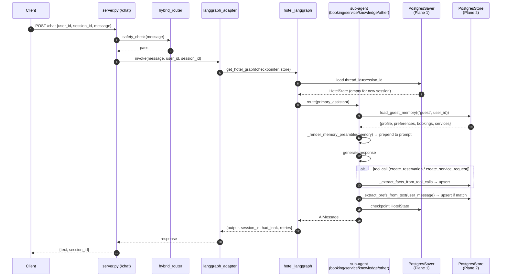

# Cross-Session Memory Flow

> [!key-insight]
> This is the flow that makes the assistant feel personalised on a returning guest's next visit. A guest logs in with the same `user_id` but a brand-new `session_id`, and the first response they see already reflects what the system learned about them in earlier conversations — without any explicit "remember this" command.

## End-to-End Sequence

## Walkthrough

### Turn 1 of Session A (first-ever visit)

- Guest arrives with `user_id=alice-123`, `session_id=session-A`.
- `("guest", "alice-123")` namespace is empty → preamble is "Known about this guest: (no prior information)".
- Alice books a Deluxe room for 3 guests. `create_reservation` tool fires.
- `_extract_facts_from_tool_calls()` upserts:
  - `profile = {name: "Alice", email: "alice@…"}`
  - `recent_bookings_summary = [{room_type: "Deluxe", check_in: "Apr 25", check_out: "Apr 27", guests: 3}]`
- Checkpoint written under `thread_id = session-A`.

### Turn 2 of Session A (same session, later)

- Alice asks "could you also add extra pillows?".
- Service sub-agent loads memory — now has Alice's profile and booking.
- Sub-agent's preamble reads: "Known about this guest: Alice, email alice@…, recent booking: Deluxe Apr 25–27."
- `create_service_request` tool fires → `service_history_summary` updated.
- Alice's free text "I prefer a quiet room on a high floor" triggers `_extract_prefs_from_text()` → `preferences = {quiet: true, floor: "high"}`.

### Session B (days later, fresh browser)

- Alice returns: `user_id=alice-123`, **new** `session_id=session-B`.
- Checkpointer has no state for `thread_id = session-B` → HotelState starts empty.
- **But** long-term store still has `("guest", "alice-123")` populated.
- First sub-agent entry loads full memory → preamble reads: "Known about this guest: Alice (alice@…), quiet high-floor preference, recent booking: Deluxe Apr 25–27, recent services: extra pillows, wake-up call."
- Response acknowledges Alice by name and respects her prior preferences on the very first turn.

## Two Planes, Two Different Answers to "Do You Remember?"

| Question | Plane 1 (Checkpointer) | Plane 2 (Store) |
|---|---|---|
| "What did I say last turn?" | Yes — full message history | Not its job |
| "What did I say last week?" | No — different `session_id` | Yes — for guests with `user_id` |
| "What did I say 60 days ago as anon?" | No | No — anon entries older than 30d are pruned |

## Anonymous Path

If the client sends no `user_id` (or `user_id="guest"`), the namespace becomes `("anon", session_id)`. Memory is still collected and used within the session, but:

- It does not cross to a different `session_id` because the namespace key *is* the `session_id`.
- `prune_anon_memory()` deletes it after 30 days (see [[anon_namespace_ttl]]).

## Failure Modes and Fallbacks

- `DATABASE_URL` absent → store falls back to `InMemoryStore`; memory works within a single process lifetime but does not survive restart.
- `langgraph-checkpoint-postgres < 2.0.13` → store module unavailable; `init_store()` silently falls back to `InMemoryStore`.
- `APP_STORE_NAME=off` → store disabled; personalisation silently degrades to stateless. Sub-agents still render a preamble with empty memory.
- `load_guest_memory()` exception → caught, logged, sub-agent proceeds with empty preamble (no user-visible error).

## Observability

Each turn's response dict carries `had_leak` and `retries` counters (see [[tool_call_codeblock_leak]]). Memory-specific telemetry is at INFO level in server logs (`prune_anon_memory: removed N rows`). A future observability pass could add: preamble size per turn, upsert counts per key, cross-session recall rate.

## Related

- [[concepts/dual_plane_memory]]
- [[concepts/rule_based_memory_write_back]]
- [[concepts/bilingual_memory_extraction]]
- [[concepts/anon_namespace_ttl]]
- [[components/hotel_langgraph]]
- [[components/server]]
- [[experiments/memory-test-suite-2026-04-20]] — the 27-case validation
- [[thesis/memory_system_design]]
