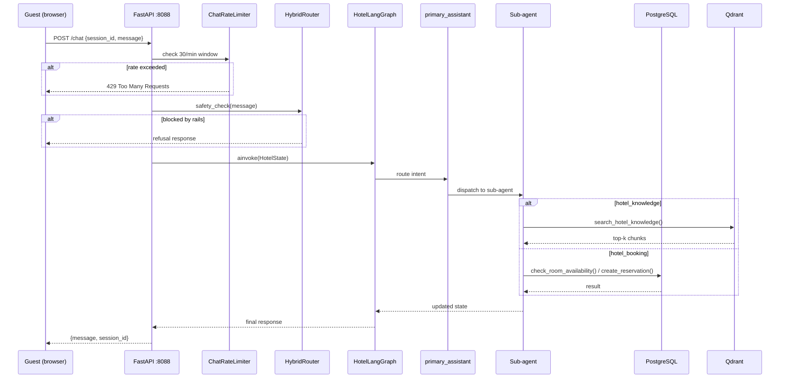

# Flow: Guest Chat (POST /chat)

The primary guest-facing flow. Handles information queries, room bookings, booking management, and general conversation. All public — no login required.

## Trigger

`POST /chat` or `POST /chat/stream` (SSE) from the hotel website frontend. Body contains `session_id`, `message`, and optional `language` hint.

## Steps

1. **Per-session rate limit** — `ChatRateLimiter` (30 msg/min per `session_id`). Exceeds → 429.
2. **Per-session async lock** — `SessionLockManager` serialises concurrent requests to the same session so the LangGraph checkpointer never interleaves writes.
3. **PII scrub** — credit-card numbers, Thai ID numbers scrubbed to `[CREDIT_CARD]` / `[THAI_ID]` before the message reaches the LLM. Emails are preserved (needed as booking tool arguments).
4. **HybridRouter safety filter** — NeMo Guardrails rails check for disallowed topics. Blocked requests return a refusal without hitting the LLM.
5. **LangGraphAdapter** — wraps the message into a `HotelState` dict and invokes `HotelLangGraph.ainvoke()`.
6. **`primary_assistant` node** — intent router. Classifies the message and routes to one of four sub-agents.
7. **Sub-agent execution** — runs the appropriate sub-agent (see Sub-agents section).
8. **LLM concurrency semaphore** — `LLMConcurrencyLimiter` (`MAX_CONCURRENT_LLM_CALLS=4`). If all slots are busy and the queue wait exceeds `LLM_QUEUE_TIMEOUT_SEC=30`, returns 503.
9. **Response** — rendered by the active sub-agent, returned via JSON (or SSE for streaming).
10. **Audit log** — privacy-sensitive session-view events written to `audit_log`.

## Sub-agents

| Sub-agent | Trigger | Tools used | Backing store |
|---|---|---|---|
| `hotel_booking` | Reservation intent | `check_room_availability`, `create_reservation`, `confirm_reservation`, `update_reservation`, `cancel_reservation`, `check_in_guest`, `check_out_guest`, `calculate_dynamic_price` | PostgreSQL |
| `hotel_service` | Amenity / service request | service info tools | PostgreSQL |
| `hotel_knowledge` | Information queries | `search_hotel_knowledge` → Qdrant vector search | Qdrant + embeddings |
| `other_talk` | General / off-topic | Direct LLM response | None |

## Sequence diagram



## Knowledge cache hot path

RAG queries go through `KnowledgeCache` (LRU + 5 min TTL, 500 entries). Cache hit returns in ~1 ms; miss calls Qdrant (~500 ms).

```
search_hotel_knowledge(query)
  → KnowledgeCache.get(query)
     HIT  → return (content, sources)   [~1ms]
     MISS → Qdrant vector search        [~500ms]
             → KnowledgeCache.set()
             → return (content, sources)
```

The reranker (`RERANKER_BACKEND`) defaults to `none` — Qdrant embedding search is accurate enough for the 10-doc hotel knowledge base, and the CrossEncoder added 1-2 s of event-loop-blocking CPU work.

## Guest identification

No login required. Guests are identified by:
- **Email address** — primary key for new bookings, history lookup, auto-register.
- **Confirmation number** (`HTL{YYMMDD}{seq}`) — lookup, modify, cancel, check-in.

When a new email is used, a guest record is auto-created (loyalty tier = Standard, points = 0).

## Failure modes

| Failure | Behaviour |
|---|---|
| LLM slots full, wait > 30s | 503 + `Retry-After` |
| Qdrant unreachable | knowledge sub-agent error propagated |
| PostgreSQL unreachable | booking/service tools raise exception |
| Safety filter triggers | polite refusal, no LLM call |
| Session lock held > timeout | queued request may time out |

## Related

- [[hotel_guardrails]] — main module
- [[hybrid_router]] — safety filter step
- [[hotel_langgraph]] — state machine
- [[reservation_lifecycle]] — booking status transitions
- [[decisions/reranker_disabled]] — why RERANKER_BACKEND=none
- [[chat_scaling]] — rate limits, semaphores, cache
