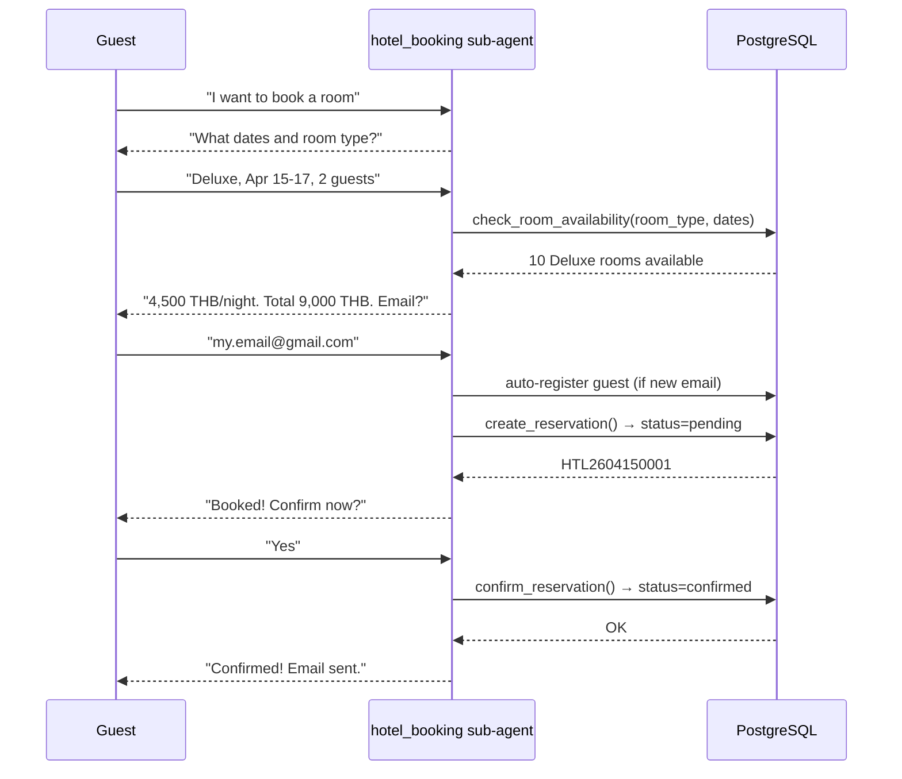
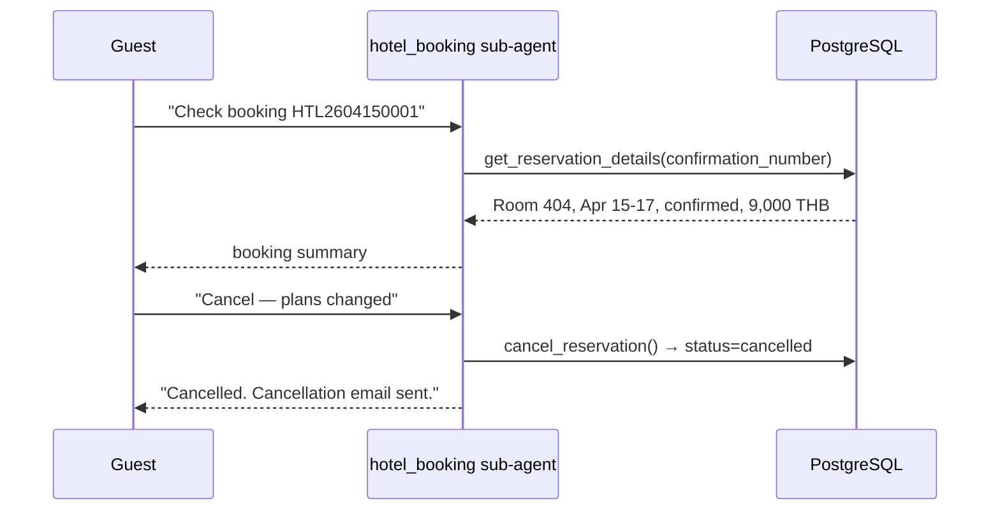
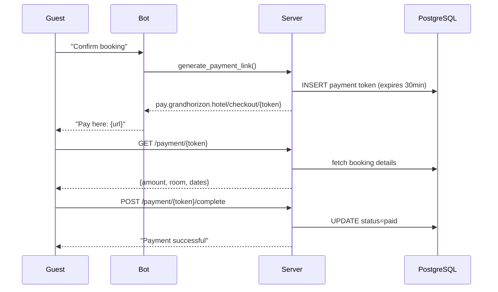

# Flow: Reservation Lifecycle

Covers the full lifecycle of a hotel booking from guest chat through to check-out, plus the admin override path.

## Status machine

```
create_reservation()        confirm_reservation()
       |                           |
       v                           v
   +--------+              +-----------+
   | pending | ----------> | confirmed |
   +--------+              +-----------+
       |                        |    |
       |   cancel_reservation() |    |  check_in_guest()
       |         |              |    |
       v         v              v    v
 +-----------+              +------------+
 | cancelled |              | checked_in |
 +-----------+              +------------+
                                   |
                                   |  check_out_guest()
                                   v
                            +--------------+
                            | checked_out  |
                            +--------------+
```

Rules:
- No hard deletes — all state changes via SQL `UPDATE`.
- `payment_status` stays `pending` throughout (demo; no real payment processing).
- Soft-cancel is safe to call at any pre-checkin status.

## New booking (multi-turn chat)



## Dynamic pricing

Applied automatically inside `create_reservation()`. The `calculate_dynamic_price` tool shows the guest the actual price before they commit.

| Days before check-in | Multiplier | Label |
|---|---|---|
| 30+ | 0.85× | Early Bird 15% off |
| 14-29 | 0.90× | Advance 10% off |
| 7-13 | 1.00× | Standard Rate |
| 1-6 | 1.20× | Last-Minute +20% |
| Same day | 1.30× | Same-Day +30% |

## Manage existing booking



## Hotel arrival (front-desk check-in)

This is an in-person flow — not chatbot. Staff verifies in the system:

1. Guest presents email or confirmation number.
2. Staff queries reservation: `status == confirmed`, room assignment matches.
3. Staff processes check-in: `check_in_guest()` → `status = checked_in`.
4. Guest pays at front desk (demo: no real transaction).
5. Guest receives room key.

Admin API: `PUT /admin/bookings/{id}/status` can force any status override (e.g., no-show).

## Mock payment flow



## Tools in `actions.py`

| Tool | Purpose |
|---|---|
| `check_room_availability(room_type, check_in, check_out)` | Returns count of available rooms and base price |
| `calculate_dynamic_price(room_type, check_in)` | Returns final price with multiplier |
| `create_reservation(email, room_type, check_in, check_out, guests)` | Creates `pending` reservation, auto-registers guest |
| `confirm_reservation(confirmation_number)` | Moves `pending → confirmed` |
| `update_reservation(confirmation_number, ...)` | Modifies dates / room type |
| `cancel_reservation(confirmation_number)` | Soft-cancel → `cancelled` |
| `check_in_guest(confirmation_number)` | `confirmed → checked_in` |
| `check_out_guest(confirmation_number)` | `checked_in → checked_out` |
| `get_reservation_details(confirmation_number \| email)` | Lookup booking |

## Failure modes

| Failure | Behaviour |
|---|---|
| Room not available | Bot reports "sold out", offers alternatives |
| Invalid confirmation number | Tool returns not-found error |
| Payment token expired | `GET /payment/{token}` returns 404 |
| DB constraint violation | Exception propagated, booking not created |

## Related

- [[guest_chat]] — parent flow
- [[hotel_guardrails]] — module containing these tools
- [[database]] — PostgreSQL schema
- [[decisions/no_hard_deletes]] — why cancellation is a status update
- [[decisions/dynamic_pricing]] — pricing multiplier rationale
