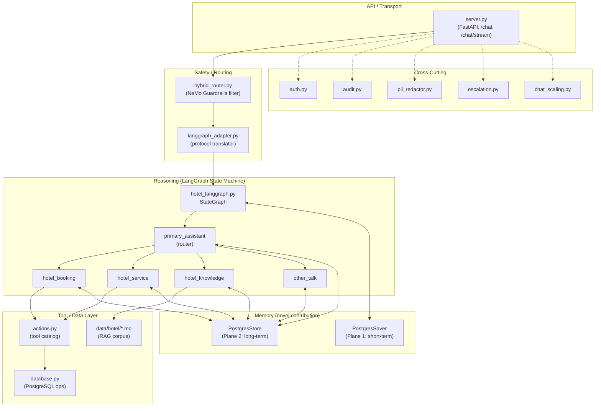
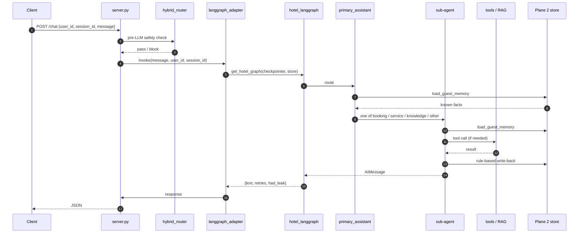

# Hotel AI Chatbot — System Design and Implementation

> [!note] Chapter scope
> This is a support chapter for the thesis that walks through the Grand Horizon Hotel AI Virtual Assistant end-to-end — architecture, request flow, sub-agent behaviour, data model, memory system, deployment, and validation. It is deliberately code-walk depth: every claim is backed by a file path and every component cross-links to a stand-alone wiki page that can be cited individually.

## 4.1 Chapter Overview

The hotel assistant is a FastAPI microservice in `src/hotel_guardrails/` that exposes a single conversational endpoint (`POST /chat`) and delegates reasoning to a [[LangGraph]] state machine with four specialised sub-agents. It is a fork of the NVIDIA AI Blueprint for AI Virtual Assistant, adapted to run on [[OpenRouter]] (cloud: [[Qwen3-max]]) and [[Ollama]] (local: [[Qwen3.5-Opus-9B]]) instead of NVIDIA NIM endpoints. It is deployed on [[Railway]] with a PostgreSQL database and a Qdrant vector store.

The system's novel contribution, described in §4.6, is a **dual-plane persistent memory layer** that combines LangGraph's short-term checkpointer with a thread-agnostic long-term store, wired uniformly into all four sub-agents so a returning guest sees personalised responses on any new `session_id`. The design and its evaluation are further detailed in [[thesis/memory_system_design]].

> [!key-insight] Chapter map
> - §4.2 High-level architecture
> - §4.3 Request flow (/chat → LangGraph → response)
> - §4.4 Sub-agents and their tool catalogs
> - §4.5 Data model — database, Pydantic schemas, knowledge base
> - §4.6 **Dual-plane memory (novel contribution)**
> - §4.7 Cross-cutting concerns — auth, audit, PII redaction, escalation, scaling
> - §4.8 Deployment
> - §4.9 Validation — evaluations and the 27-case memory suite
> - §4.10 Design trade-offs

## 4.2 High-Level Architecture

The assistant is organised in five architectural layers, each a stand-alone Python module under `src/hotel_guardrails/`:

The five layers are deliberately separated so each can be reasoned about in isolation. The safety router ([[hybrid_router]]) is a thin filter that runs before any LangGraph state transitions; the adapter ([[langgraph_adapter]]) is the only place that knows about both the server's request shape and the graph's state shape; the reasoning layer ([[hotel_langgraph]]) is free of I/O concerns except for tool calls. This layering makes it possible to swap the LLM backend (Qwen3-max ↔ Qwen3.5-Opus-9B ↔ Llama 3.3 70B) without touching any layer other than the LLM factory inside `hotel_langgraph.py`.

### Module inventory

| Module | Responsibility | Wiki |
|---|---|---|
| `server.py` | FastAPI app, lifespan, endpoints, CORS, middleware | [[components/server]] |
| `hybrid_router.py` | NeMo-Guardrails-style pre-LLM safety gate | [[components/hybrid_router]] |
| `langgraph_adapter.py` | Request ↔ graph state translator | [[components/langgraph_adapter]] |
| `hotel_langgraph.py` | `StateGraph`, sub-agents, memory, LLM factory | [[components/hotel_langgraph]] |
| `actions.py` | Tool catalog | [[components/actions]] |
| `database.py` | Rooms / bookings / guests operations | [[components/database]] |
| `models.py` | Pydantic request/response schemas | [[components/pydantic_models]] |
| `auth.py` | Token issuance / validation | [[components/auth]] |
| `audit.py` | Event logging | [[components/audit]] |
| `pii_redactor.py` | Pre/post-LLM PII scrubbing | [[components/pii_redactor]] |
| `escalation.py` | Human-in-the-loop handoff | [[components/escalation]] |
| `chat_scaling.py` | Concurrency / backpressure | [[components/chat_scaling]] |
| `feedback_collector.py` | Response-quality feedback | [[components/feedback_collector]] |
| `openrouter_llm.py` | OpenRouter LLM wrapper | [[components/openrouter_llm_wrapper]] |

## 4.3 Request Flow

A guest turn is processed in eight stages:

Each stage has a focused responsibility:

1. **Transport.** `server.py` validates the [[components/pydantic_models|ChatRequest]] (which now carries `user_id: Optional[str]`) and handles CORS, request IDs, and error mapping.
2. **Safety filter.** [[hybrid_router]] runs a NeMo-Guardrails-style pre-check (prompt injection, toxicity, policy matches) before any LLM cost is incurred.
3. **Adapter.** [[langgraph_adapter]] maps the HTTP request shape to `HotelState` and forwards the `store` handle to `get_hotel_graph()` (the latter a post-2026-04-20 change).
4. **Routing.** `primary_assistant` selects one of four sub-agents via a routing tool-call (`ToHotelBooking` / `ToHotelService` / `ToHotelKnowledge` / `HandleOtherTalk`). The prompt is explicit with Thai-language examples because the 9B model needs concrete examples to route correctly (e.g. "ยกเลิกการจอง" → booking, not other_talk).
5. **Memory preamble.** Each sub-agent calls `load_guest_memory(state)` on entry and injects `_render_memory_preamble(memory)` into its prompt template. See §4.6.
6. **Tool loop.** Booking and service can invoke their tool catalog and loop back; knowledge and other_talk go directly to `END`.
7. **Write-back.** After the sub-agent produces its `AIMessage`, `_extract_prefs_from_text()` and `_extract_facts_from_tool_calls()` upsert Plane 2 facts (rule-based, zero extra LLM calls).
8. **Quality retry + post-processing.** `invoke_hotel_agent` wraps the graph with a retry loop that detects tool-call leaks (see §4.10) and strips them via `strip_tool_call_codeblocks()` before returning.

## 4.4 Sub-Agents

Four sub-agents specialise in disjoint conversational domains. Each has its own prompt template, its own tool subset, and its own entry node that converts the primary assistant's routing tool-call into a valid `ToolMessage`.

### 4.4.1 Booking — [[components/booking_subagent]]

**Tools:** `check_room_availability`, `create_reservation`, `cancel_reservation`, `get_reservation_details`, `get_guest_reservations`, `calculate_dynamic_price`.

**Behaviour:** Natural-language form-filling. The sub-agent asks for missing fields (dates, room type, guest count, email) before invoking `create_reservation`; on confirmation, it emits the reservation ID in its reply. `create_reservation` tool-call args feed the [[rule_based_memory_write_back|memory write-back]] path to populate `profile.name`, `profile.email`, and `recent_bookings_summary`.

**Tool loops:** yes — the sub-agent can ask clarifying questions, call a tool, then call another, until it decides the user is satisfied.

### 4.4.2 Service — [[components/service_subagent]]

**Tools:** `create_service_request`, `get_hotel_services`.

**Behaviour:** Handles in-stay requests: extra pillows, wake-up calls, spa bookings, housekeeping timing. `create_service_request` args feed `service_history_summary` in Plane 2. Like booking, the sub-agent loops: "what service?" → call → "anything else?".

### 4.4.3 Knowledge — [[components/knowledge_subagent]]

**Tools:** `search_hotel_knowledge` (Qdrant-backed RAG over `data/hotel/*.md`).

**Behaviour:** Answers factual questions about the hotel: breakfast hours, spa services, pool hours, transportation, nearby attractions. Does NOT loop — one retrieval, one answer, then `END`. The preamble allows the sub-agent to personalise recommendations (e.g., "vegetarian restaurants" if the guest's `preferences.diet` is set).

**Knowledge base:** 10 markdown files totalling ~40 KB covering dining, facilities, room types, policies, emergency contacts, local attractions, spa & wellness, transportation, and an FAQ. See [[references/hotel_knowledge_base]] (pending).

### 4.4.4 Other Talk — [[components/other_talk_subagent]]

**Tools:** none.

**Behaviour:** Catch-all for greetings, small talk, closing pleasantries, and any topic not served by the first three sub-agents. Still calls `load_guest_memory` so it can address the guest by name.

> [!note] Why four, not one?
> A single monolithic prompt would need to know every tool and every policy simultaneously — too much context for a 9B local model to keep coherent. Specialised sub-agents keep each prompt short and focused. See [[decisions/four_subagent_split]].

## 4.5 Data Model

### 4.5.1 Hotel database ([[components/database]])

Three core tables in PostgreSQL:

| Table | Purpose | Key columns |
|---|---|---|
| `rooms` | Physical inventory | `room_number`, `room_type`, `base_price`, `floor`, `features` |
| `bookings` | Confirmed reservations | `booking_id`, `guest_email`, `check_in`, `check_out`, `room_type`, `guests`, `status` |
| `guests` | Profile data (optional, linked by email) | `email`, `name`, `loyalty_tier`, `phone` |

Schema initialised by `deploy/compose/init-scripts/init-hotel.sql`. Connections use an `AsyncConnectionPool` distinct from both the checkpointer pool and the store pool (three separate pools on the same URI).

### 4.5.2 Request / response schemas ([[components/pydantic_models]])

`ChatRequest` is the main client-facing model:

| Field | Type | Purpose |
|---|---|---|
| `message` | `str` | User turn |
| `session_id` | `Optional[str]` | Conversation / `thread_id` for Plane 1 |
| `user_id` | `Optional[str]` (max 128) | Stable guest identity — new in 2026-04-20 commit |
| `language` | `Optional[str]` | `en` / `th` / `auto` |

`ChatResponse` returns `text`, `session_id`, `current_intent`, optionally `tool_calls`, `retries`, and `had_leak` for observability.

### 4.5.3 Knowledge base (`data/hotel/*.md`)

Ten domain-specific Markdown files — `dining_services.md`, `emergency_contacts.md`, `facilities_amenities.md`, `hotel_faq.md`, `local_attractions.md`, `policies_rules.md`, `room_guide.md`, `room_types.md`, `spa_wellness.md`, `transportation.md`. Chunked and embedded at ingest time into a Qdrant collection that the `search_hotel_knowledge` tool queries. The corpus is intentionally hand-written (not scraped) to ensure factual consistency within the thesis environment.

## 4.6 Dual-Plane Persistent Memory (Novel Contribution)

> [!key-insight]
> This is the thesis's primary architectural contribution. The design documentation and references live in [[thesis/memory_system_design]]; this section walks through the implementation.

### 4.6.1 Motivation

Conversational agents have two categorically different memory needs: **short-term** (within a session) and **long-term** (across sessions). These are well-studied in cognitive models (episodic vs. semantic memory) and in recent agent-systems literature (MemGPT, MemoryBank, Generative Agents). [[LangGraph]] exposes two separate abstractions for them — `BaseCheckpointSaver` and `BaseStore` — but *most* open-source LangGraph projects use only the first and leave cross-session personalisation to the client application or to an external tool like [[Mem0]]. This thesis implements both natively, uniformly across all four sub-agents.

For the hospitality domain the distinction is not merely academic. Buhalis et al. (2023) argue that the value of AI in hospitality is not one-off assistance but *continuous personalisation* across a guest's lifetime relationship with the property — which demands a long-term store that survives session boundaries.

### 4.6.2 Two planes, two pools

| Aspect | Plane 1 — Short-Term | Plane 2 — Long-Term |
|---|---|---|
| Class | `AsyncPostgresSaver` | `AsyncPostgresStore` |
| Identity key | `thread_id = session_id` | `("guest", user_id)` or `("anon", session_id)` |
| Invocation | Automatic, after every node | Manual, from sub-agent code |
| Tables | `checkpoints`, `checkpoint_blobs`, `checkpoint_writes` | `store`, `store_migrations` |
| Connection pool | `min=2, max=10` | `min=1, max=5` |
| Retention | Until explicit delete | Indefinite (guest) / 30 days (anon) |
| Fallback | `MemorySaver` | `InMemoryStore` |

Separate connection pools are deliberate: a slow `store` query cannot starve `checkpoint` writes, which must respond quickly on every node transition. See [[dual_plane_memory]].

### 4.6.3 Read path — preamble injection

Every sub-agent (and the primary router) calls `load_guest_memory(state)` on entry. The returned dict is rendered by `_render_memory_preamble()` into a compact system-level block — "Known about this guest: Alice (alice@…), high-floor preference, vegetarian, …" — and prepended to the sub-agent's prompt. A returning guest with `user_id=alice-123` starting a fresh `session_id` therefore recovers everything the system learned in earlier sessions on the very first turn. See [[components/memory_preamble_injector]].

### 4.6.4 Write path — rule-based, zero extra LLM calls

Two paths populate Plane 2, both deterministic:

1. **Free-text path** — `_extract_prefs_from_text()` scans each `HumanMessage` against English and Thai keyword tables and upserts the `preferences` key. See [[rule_based_memory_write_back]] and [[bilingual_memory_extraction]].
2. **Tool-call path** — `_extract_facts_from_tool_calls()` inspects `AIMessage.tool_calls` for `create_reservation` and `create_service_request` and extracts structured facts from their args (`profile.name`, `profile.email`, `recent_bookings_summary`, `service_history_summary`).

The explicit design choice is **zero extra LLM calls** per turn. An LLM-based summariser would add latency, cost, and determinism concerns; rule-based extraction loses some coverage but is fast, cheap, and predictable.

### 4.6.5 Anonymous namespace TTL

Authenticated guests get indefinite retention. Anonymous visitors (no `user_id`) are keyed by `("anon", session_id)` and automatically pruned after 30 days by `prune_anon_memory()`, scheduled at 24h intervals by the FastAPI lifespan. This is the compliance-motivated boundary between "identified" and "anonymous" memory. See [[anon_namespace_ttl]].

### 4.6.6 Post-processing — the tool-call leak problem

Local 9B models occasionally emit their tool-call syntax as prose instead of as a structured tool call. Three distinct leak shapes have been catalogued from real traffic (fenced code blocks, Qwen/Hermes-style `<call_TOOL(...)>` tags, dangling truncations from `max_tokens`) and are stripped by `strip_tool_call_codeblocks()` before the response reaches the user. The post-processor is tool-name-aware so legitimate code snippets survive. See [[tool_call_codeblock_leak]].

### 4.6.7 Validation

The new `memory` test suite has 27 multi-turn cases — 5 short-term, 11 long-term by store key, 6 Thai-language, 2 accumulation, 3 edge/negative. All 27 pass on local [[Qwen3.5-Opus-9B]] via [[Ollama]]. Isolation and no-hallucination cases use `reject` lists of ownership phrases ("you prefer a king", "your peanut allergy") that must NOT appear in responses to unknown users. See [[memory-test-suite-2026-04-20]].

## 4.7 Cross-Cutting Concerns

### 4.7.1 Authentication — [[components/auth]]

Dual-identity model (see [[decisions/dual_identity_model]]): guests identify by `user_id` (optional, free-form) while staff / admin paths use token-based authentication. Reflected in the code as separate dependency-injection chains in `server.py`.

### 4.7.2 Audit — [[components/audit]]

Structured JSON events to stdout (captured by Railway log aggregation) for every `/chat` turn: request ID, session ID, user ID if present, sub-agent routed to, tool calls made, response length, latency, `had_leak` flag. Enables post-hoc incident review without persisting the conversation itself in audit-grade storage.

### 4.7.3 PII redaction — [[components/pii_redactor]]

Regex-based scrubbing of email addresses, phone numbers, and booking references from *log output* (not from the conversation itself — the sub-agent needs the real email to call `create_reservation`). Cross-references the [[pii_redaction_and_compliance]] literature background and the [[Microsoft Presidio]] entity as a potential future upgrade. See the component page for specific patterns.

### 4.7.4 Escalation — [[components/escalation]]

Human-in-the-loop handoff for confidence drops, explicit "speak to a human" requests, and policy-violation cases. Currently queue-based (writes to a Postgres `escalations` table); a future iteration could wire this to Slack / Intercom. Cross-references [[human_in_the_loop]] literature.

### 4.7.5 Concurrency / scaling — [[components/chat_scaling]]

Async request handling throughout; the bottleneck is LLM inference latency, not the Python layer. A semaphore caps concurrent graph invocations to a tunable value so a burst of traffic cannot starve the LLM backend's connection budget. See [[chat_scaling]] flow.

## 4.8 Deployment

### 4.8.1 Runtime

Python 3.12 (see [[python_312_runtime]] decision). Uvicorn on port 8081 (bare-metal) or 8088 (inside Docker Compose per [[local_run]]). Dependencies pinned in `src/hotel_guardrails/requirements.txt`; the 2026-04-20 commit bumps `langgraph-checkpoint-postgres` to `>=2.0.13,<3.0.0` to pick up `AsyncPostgresStore`.

### 4.8.2 Containerisation

Multi-stage `Dockerfile` producing a slim runtime image. Health-check hits `/healthz` which now verifies the checkpointer pool is usable (`SELECT 1 FROM checkpoints LIMIT 1`).

### 4.8.3 Railway

Production target. `railway.toml` + `Procfile` specify the start command and health check. Railway also hosts the Qdrant collection and the PostgreSQL database the assistant talks to. See [[decisions/railway_deployment]].

### 4.8.4 Docker Compose

`deploy/compose/docker-compose.dev.yaml` is the local-dev stack (OpenRouter + Railway-hosted Qdrant/PostgreSQL); `docker-compose.yaml` is the original NVIDIA full stack (Milvus, NIM, etc.). See [[flows/local_run]].

## 4.9 Validation

The system has three validation surfaces, each cross-referenced from the thesis:

1. **Model evaluation** — 100% (25/25) for cloud [[Qwen3-max]] and 92% (23/25) for local [[Qwen3.5-Opus-9B]] on the hotel benchmark. Cohen's κ = 0.000 on disjoint failure sets: the two models fail on non-overlapping cases. See [[experiments/model-eval-local-vs-cloud-2026-04-06]].
2. **Functional / tuning suite** — 94% after seven targeted fixes; 193/193 infrastructure tests. See [[experiments/model-tuning-and-test-results-2026-04-03]].
3. **Memory suite (new)** — 27/27 on local Qwen3.5-Opus-9B, covering every store key, both languages, and all negative/isolation cases. See [[memory-test-suite-2026-04-20]].

## 4.10 Design Trade-offs

### 4.10.1 Hybrid LangGraph + NeMo Guardrails

A pure NeMo Guardrails stack offers stronger rail definitions but less flexible multi-step reasoning; a pure LangGraph stack offers powerful state-machine composition but weaker pre-LLM safety. The hybrid uses NeMo for the pre-filter and LangGraph for reasoning — the best of both at the cost of two frameworks to learn. See [[decisions/hybrid_langgraph_nemo]].

### 4.10.2 Rule-based vs. LLM-based memory write-back

Rule-based extraction misses some paraphrases ("please keep me away from tree nuts" instead of "I have a peanut allergy"). An LLM summariser would catch more but would add one extra LLM call per turn, doubling latency and cost. The thesis position is that **bounded correctness at predictable cost** beats **higher coverage at unpredictable cost** for a production concierge; the gap can be closed later with a smaller, cheaper summariser model once traffic patterns justify it.

### 4.10.3 Zero-LLM post-processing for leak cleanup

Same framing: a generative post-processor could rewrite leaky output into natural prose, but a deterministic regex strip is cheaper and auditable. The tool-name-aware design keeps false-positive rates near zero. See [[tool_call_codeblock_leak]].

### 4.10.4 Separate connection pools for Plane 1 / Plane 2

Adds a few dozen MB of memory and doubles the `pg_stat_activity` footprint. In exchange, a slow long-term-store operation cannot starve the fast-path checkpoint writes. For a production concierge where the checkpointer is on the synchronous response path and the store is off the critical path for most turns, this is the correct bias.

### 4.10.5 Dual model strategy (local + cloud)

Running both Qwen3-max (cloud, 100%) and Qwen3.5-Opus-9B (local, 92%) lets the thesis compare frontier-vs.-local tradeoffs honestly. The cost is two model-specific tuning passes (prompts, retries, post-processor); the benefit is a credible "works on commodity hardware" claim. See [[openrouter_dev_backend]].

## 4.11 Open Gaps

Collected for completeness; each is tracked under `wiki/gaps/`:

- [[mcp_integration_missing]] — no Model Context Protocol adapter yet
- [[eval-gaps-from-apr-experiments]] — eval harness gaps identified April 2026
- Cloud re-run of the 27-case memory suite (expected to pass; not yet confirmed)
- Concurrent-write stress test for Plane 2 under real MVCC load
- Larger KB with scraped real-world hotel pages (currently hand-written, 10 files)

## 4.12 References (Chapter-Local)

External papers are cited in [[thesis/memory_system_design]] and the broader thesis `REFERENCES.md`. The wiki pages below are the internal references.

### Code-level

[[components/server]] · [[components/hybrid_router]] · [[components/langgraph_adapter]] · [[components/hotel_langgraph]] · [[components/primary_assistant]] · [[components/booking_subagent]] · [[components/service_subagent]] · [[components/knowledge_subagent]] · [[components/other_talk_subagent]] · [[components/actions]] · [[components/database]] · [[components/pydantic_models]] · [[components/auth]] · [[components/audit]] · [[components/pii_redactor]] · [[components/escalation]] · [[components/feedback_collector]] · [[components/openrouter_llm_wrapper]]

### Concepts

[[dual_plane_memory]] · [[rule_based_memory_write_back]] · [[bilingual_memory_extraction]] · [[tool_call_codeblock_leak]] · [[anon_namespace_ttl]] · [[hybrid_rag_with_reranking]] · [[persistent_memory_chatbot]] · [[langgraph_state_machine_architecture]] · [[Hybrid Routing]]

### Flows

[[flows/guest_chat]] · [[flows/cross_session_memory]] · [[flows/reservation_lifecycle]] · [[flows/auth_and_access_control]] · [[flows/local_run]] · [[flows/admin_monitoring]] · [[flows/chat_scaling]]

### Decisions (ADRs)

[[decisions/hybrid_langgraph_nemo]] · [[decisions/four_subagent_split]] · [[decisions/fork_nvidia_blueprint]] · [[decisions/openrouter_dev_backend]] · [[decisions/qdrant_dev_milvus_prod]] · [[decisions/railway_deployment]] · [[decisions/python_312_runtime]] · [[decisions/dual_identity_model]] · [[decisions/reranker_disabled]]

### Experiments

[[experiments/memory-test-suite-2026-04-20]] · [[experiments/model-eval-local-vs-cloud-2026-04-06]] · [[experiments/model-tuning-and-test-results-2026-04-03]]

### Thesis

[[thesis/memory_system_design]] · [[thesis/evaluation_methodology]]
