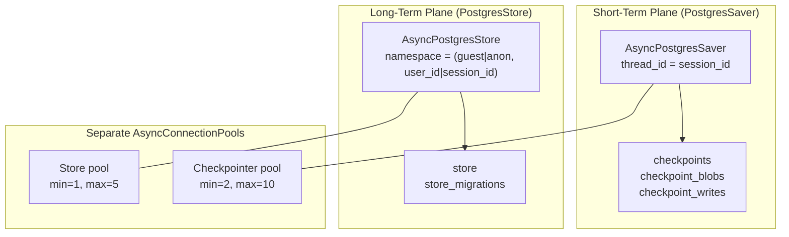

# Memory System Design — Dual-Plane Persistent Memory

> [!key-insight]
> This page documents the novel contribution of the thesis: a dual-plane persistent memory architecture for the hotel AI assistant, combining PostgresSaver (short-term) and PostgresStore (long-term) backed by PostgreSQL, with rule-based bilingual write-back. This maps to **Chapter 2 §2.3.4** and **Chapter 4/5** of the thesis.

## Chapter 2 §2.3.4 — Drop-in Text

> **2.3.4 Persistent State and Memory in Agentic Systems**
>
> Conversational agents exhibit two categorically different memory needs. **Short-term memory** retains the turn-by-turn content of a single dialogue — the messages, tool calls, and intermediate reasoning — and must survive process restarts if the system is to be production-grade. **Long-term memory** retains facts about a user across sessions — preferences, history, and salient traits — and is the mechanism by which an agent feels personalised on a returning visit rather than starting from zero. This distinction parallels the episodic/semantic split in cognitive memory models and has become standard in the agent-systems literature (Park et al., 2023; Packer et al., 2023; Zhong et al., 2024).
>
> LangGraph exposes these two needs through two separate abstractions. The `BaseCheckpointSaver` interface is invoked after every node transition and persists the full graph state keyed by `thread_id`; its PostgreSQL implementation, `PostgresSaver`, writes to a small family of `checkpoints`, `checkpoint_blobs`, and `checkpoint_writes` tables and allows exact replay as well as "time-travel" debugging (LangChain AI, 2024a). The `BaseStore` interface, in contrast, is thread-agnostic: it exposes a namespaced key-value API (`get`, `put`, `search`) against which any node in any graph execution can read or write, and its `PostgresStore` implementation backs those operations with ACID-compliant PostgreSQL rows (LangChain AI, 2024b). Separating the two is deliberate — their access patterns, consistency requirements, and retention policies differ, and coupling them would compromise both.
>
> For the hospitality domain this separation is directly motivated. Buhalis and Moldavska (2022) identify "context retention across turns" as one of three prerequisites for a usable AI concierge; the checkpointer satisfies this. Buhalis, O'Connor, and Leung (2023) further argue that the value proposition of AI in hospitality is not one-off assistance but *continuous* personalisation across a guest's lifetime relationship with the property; this demands the second, cross-session layer that a long-term store provides. PostgreSQL is a natural substrate for both: its MVCC concurrency model (PostgreSQL Global Development Group, 2024) guarantees that concurrent sub-agent writes to the same guest's memory namespace do not corrupt each other, while its operational maturity is an implicit requirement for a system that will hold personally-identifying guest data.
>
> This thesis implements both layers — `PostgresSaver` for short-term dialogue persistence and `PostgresStore` for long-term guest memory — and wires the long-term layer into each of the four sub-agents so that context recall is uniform across booking, service, knowledge, and general-conversation flows. The concrete implementation is described in Chapter 4 (System Design) and Chapter 5 (Implementation); Figure 2.4 illustrates the conceptual architecture.

## Architecture Overview

The dual-plane architecture splits memory into two orthogonal backing systems, both grounded in [[PostgreSQL]]:



**Why separate pools?** A stuck store query cannot starve checkpoint writes. The two operations have different latency profiles and consistency requirements — coupling them would introduce a single point of contention.

## Figure 2.4 Caption

> **Figure 2.4** Persistent memory architecture in the hotel assistant. The LangGraph agent maintains two distinct memory planes backed by PostgreSQL: a `PostgresSaver` checkpointer that persists per-session dialogue state (keyed by `thread_id = session_id`) and a `PostgresStore` that persists per-guest long-term memory (keyed by `user_id` under the `(guest, user_id)` namespace). Each of the four sub-agents reads from the store on entry and writes through it on exit, while the checkpointer is invoked automatically by the framework after every node transition.

## What Was Already Present vs. What Was Added

| Component | Status Before This Work | Status After |
|---|---|---|
| `AsyncPostgresSaver` | Already wired; `thread_id=session_id` | Verified, `/healthz` probe added |
| `langgraph-checkpoint-postgres==2.0.0` | Already pinned | Upgraded to ≥2.0.13 for store module |
| `AsyncPostgresStore` | Not installed, not wired | New: `init_store()`/`close_store()`, separate pool |
| Sub-agent memory read | None | `load_guest_memory()` + `_render_memory_preamble()` on all 4 sub-agents + primary router |
| Memory write-back | None | Rule-based `_extract_prefs_from_text()` + `_extract_facts_from_tool_calls()` |
| Anonymous TTL | None | `prune_anon_memory()` + 24h scheduled sweeper in FastAPI lifespan |
| Memory test suite | None | 27 new multi-turn cases in `scripts/test_4_subagents.py` |

## Namespace Convention

| Key | Value |
|---|---|
| `("guest", user_id)` | Authenticated guest — indefinite retention |
| `("anon", session_id)` | Anonymous session — 30-day TTL via `prune_anon_memory()` |

Memory keys per namespace:
- `profile` — `{name, email, loyalty_tier, language}`
- `preferences` — `{floor, allergy, diet, bed, quiet, pillows, …}`
- `recent_bookings_summary` — list of booking dicts (last 10)
- `service_history_summary` — list of service type strings (last 10, deduplicated)

## Write Policy: Rule-Based, No LLM

The design explicitly chose **zero LLM calls** for memory extraction. Every write is rule-based:

1. **Free-text preference extraction** (`_extract_prefs_from_text`): scans each `HumanMessage` against keyword tables for English and Thai patterns.
2. **Tool-call write-back** (`_extract_facts_from_tool_calls`): after sub-agent produces an `AIMessage` with tool calls, inspects the args of `create_reservation` and `create_service_request` to extract profile, booking summary, and service history fields.

See [[concepts/rule_based_memory_write_back]] and [[concepts/bilingual_memory_extraction]] for full details.

## Verified Behaviour

All 27 memory test cases passed (27/27) on local Qwen3.5-Opus-9B. See [[experiments/memory-test-suite-2026-04-20]] for the full breakdown.

## Schema Verification

```sql
-- Confirm both planes exist after init:
\dt
-- Expected: checkpoints, checkpoint_blobs, checkpoint_writes, store, store_migrations

-- Spot-check long-term guest memory:
SELECT namespace, key FROM store WHERE namespace[1]='guest' LIMIT 20;
```

## References

- LangChain AI. (2024a). *LangGraph — Persistence: Checkpointers and Stores*. https://langchain-ai.github.io/langgraph/concepts/persistence/
- LangChain AI. (2024b). *LangGraph — Memory: Short-term and Long-term*. https://langchain-ai.github.io/langgraph/concepts/memory/
- Packer, C., et al. (2023). *MemGPT: Towards LLMs as Operating Systems*. arXiv:2310.08560.
- Park, J. S., et al. (2023). *Generative Agents: Interactive Simulacra of Human Behavior*. UIST '23.
- PostgreSQL Global Development Group. (2024). *PostgreSQL 16 Documentation — Concurrency Control*.
- Zhong, W., et al. (2024). *MemoryBank: Enhancing Large Language Models with Long-Term Memory*. AAAI '24.

## How Implemented (Code-Level Links)

| Layer | Wiki Page |
|---|---|
| Store init/close | [[components/guest_memory_store]] |
| Preamble rendering + injection | [[components/memory_preamble_injector]] |
| Tool-call leak post-processor | [[components/tool_call_post_processor]] |
| Anonymous TTL sweeper | [[components/anon_memory_sweeper]] |
| State machine wiring | [[components/hotel_langgraph]] |
| Cross-session flow | [[flows/cross_session_memory]] |

## Related Concept Pages

- [[concepts/dual_plane_memory]] — the two-plane model explained
- [[concepts/rule_based_memory_write_back]] — zero-LLM extraction
- [[concepts/bilingual_memory_extraction]] — Thai + English keywords
- [[concepts/tool_call_codeblock_leak]] — 9B model leak patterns and the strip post-processor
- [[concepts/anon_namespace_ttl]] — GDPR-motivated anonymous TTL
- [[concepts/persistent_memory_chatbot]] — broader context
